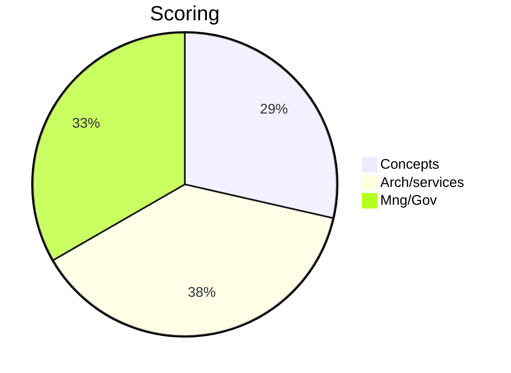
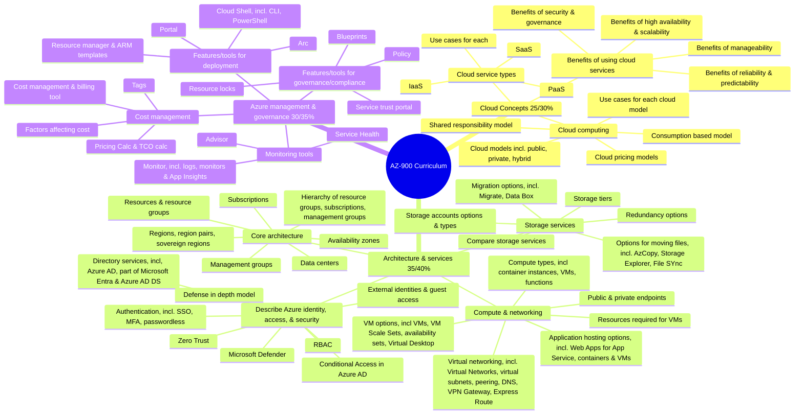

Photo by <a href="https://unsplash.com/@nguyendhn?utm_source=unsplash&utm_medium=referral&utm_content=creditCopyText">Nguyen Dang Hoang Nhu</a> on <a href="https://unsplash.com/photos/qDgTQOYk6B8?utm_source=unsplash&utm_medium=referral&utm_content=creditCopyText">Unsplash</a>

# AZ-900: Microsoft Azure Fundamentals

The Microsoft Azure Fundamentals exam is designed for candidates who are new to cloud-based solutions and services, or who are just beginning to work with Azure. This exam tests foundational knowledge of cloud services and how they are provided with Microsoft Azure. Candidates should be familiar with general technology concepts, including networking, storage, compute, application support, and application development. The exam covers cloud concepts, Azure services, Azure workloads, security and privacy in Azure, as well as Azure pricing and support. Successful completion of this exam proves knowledge of these concepts and is a valuable credential for those working with or interested in cloud-based solutions

Passing score: **700**/1000
- Describe cloud concepts (25–30%)
- Describe Azure architecture and services (35–40%)
- Describe Azure management and governance (30–35%)

> Some questions on the exam may not be included in your score. These questions are used to gather data to update and improve the quality of each exam. You won’t know which questions are unscored, so you should answer every question as if it will be included in your score.

> After completing most exams, including the Microsoft Azure Fundamentals exam, you can expect to receive your results within minutes. You will receive a report with your exam score and feedback on your performance.

# Introduction

Microsoft Azure is a cloud computing platform.
- Offers a wide range of services for simple and complex business solutions.
- Provides web services for hosting business presence in the cloud.
- Supports fully virtualized computers for custom software solutions.
- Provides cloud-based services like remote storage, database hosting, and centralized account management.
- Offers new capabilities like AI and IoT services.

# Cloud Computing

Cloud computing delivers IT services over the internet by using a pay-as-you-go pricing model.
-Services include infrastructure like virtual machines, storage, databases, and networking.
- Cloud services also offer new capabilities like IoT, ML, and AI.
- Cloud computing is not constrained by physical infrastructure like traditional datacenters.
- Cloud computing allows for rapid IT expansion without building new datacenters.

Basic services
- Compute
- Storage

!!Why not networking?

## Shared responsibility model

Traditional data center management
- Physical space
- Mantaining/replacing servers
- Backups
- Updates/patches/correct version
- Physical security
- Resource redundancy (electricity, network access, cooling)

The shared responsibility model splits responsibilities between cloud provider and consumer.
- Cloud provider is responsible for physical security, power, cooling, and network connectivity.
- Consumer is responsible for data, information, access security in the cloud

Some things are situational i.e
- Responsibility for database patches and updates
  - on a managed cloud SQL DB falls to the cloud provider.
  - on an unmanaged virtual machine with SQL falls to the consumer.

Summary
- Cloud computing shifts responsibilities compared to on-premises datacenters.
- Shared responsibility model is tied to cloud service types: IaaS, PaaS, and SaaS.
- IaaS places more responsibility on consumer, while SaaS places more responsibility on cloud provider.
- PaaS falls somewhere in the middle and evenly distributes responsibility.

> ©️ Image source: [Microsoft Learn](https://learn.microsoft.com/en-us/training/modules/describe-cloud-compute/4-describe-shared-responsibility-model)

> ©️ Image source: [Microsoft Learn](https://learn.microsoft.com/en-us/azure/security/fundamentals/shared-responsibility)

## Cloud models

3 main
- private
- public
- hybrid

Private cloud
- Private cloud is the evolution from a corporate datacenter.
- It's used by a single entity, providing greater control for the company and its IT department.
- Private cloud comes with greater cost and fewer benefits than public cloud deployment.
- Private cloud can be hosted onsite or offsite in a dedicated datacenter, potentially by a third party.

Public cloud
- Public cloud is built, controlled, and maintained by a third-party cloud provider.
- Anyone can access and use resources with a public cloud.
- Public cloud resources are generally available to the general public.
- Public cloud differs from private cloud in terms of general availability.

Hybrid cloud
- A hybrid cloud uses both public and private clouds in an interconnected environment.
- Hybrid cloud can be used to allow private cloud to surge for increased temporary demand by deploying public cloud resources.
- Hybrid cloud provides an extra layer of security, allowing users to choose which services to keep in public cloud and which to deploy to private cloud infrastructure.

| Public cloud                                                          | Private cloud                                                      | Hybrid cloud                                                      |
| --------------------------------------------------------------------- | ------------------------------------------------------------------ | ----------------------------------------------------------------- |
| No capital expenditures to scale up                                   | Organizations have complete control over resources and security    | Provides the most flexibility                                     |
| Applications can be quickly provisioned and deprovisioned             | Data is not collocated with other organizations’ data              | Organizations determine where to run their applications           |
| Organizations pay only for what they use                              | Hardware must be purchased for startup and maintenance             | Organizations control security, compliance, or legal requirements |
| Organizations don’t have complete control over resources and security | Organizations are responsible for hardware maintenance and updates |                                                                   |

| **Cloud Type** | **Advantages**                                     | **Disadvantages**                                       |
| :------------- | :------------------------------------------------- | :------------------------------------------------------ |
| Public Cloud   | No capex, quick provisioning, pay-as-you-go        | Limited control over resources and security             |
| Private Cloud  | Complete control over resources and security       | Capex for startup and maintenance, data not collocated  |
| Hybrid Cloud   | Most flexibility, choose where to run applications | Complex to manage, responsible for hardware maintenance |

Multi cloud
- Multi-cloud is a scenario where multiple public cloud providers are used.
- Different features from different cloud providers may be used, or there may be a migration process between providers.
- In a multi-cloud environment, resources and security must be managed in both environments.

## Managing multiple cloud types with Azure

Azure Arc
- Azure Arc is a set of technologies that helps manage your cloud environment.
- Azure Arc can help manage your cloud environment, whether it's a public cloud solely on Azure, a private cloud in your datacenter, a hybrid configuration, or even a multi-cloud environment running on multiple cloud providers at once.

Azure VMware Solution
- Allows you to run your existing VMware workloads in a private cloud that you want to migrate to a public cloud in Azure with seamless integration and scalability.

## Consumption based model

Two types of expenses in IT infrastructure models: CapEx and OpEx.
- CapEx is a one-time, up-front expense for tangible resources.
- OpEx is spending on services or products over time.
- Cloud computing is OpEx, operating on a consumption-based model. Pay only for the IT resources used; no payment for physical  infrastructure, electricity, or security.

Benefits of consumption-based model in cloud computing:
- No upfront costs.
- No need to purchase and manage costly infrastructure that might not be used to its fullest potential.
- Ability to pay for more resources when needed.
- Ability to stop paying for resources that are no longer needed.

Traditional datacenters require estimation of future resource needs, leading to potential waste or decreased performance.
- Under-provisioned datacenters can take time to fix with added hardware, power, cooling, and networking.
- Cloud-based models provide flexible resource allocation without worrying about getting it just right.
- Add or remove virtual machines as needed without paying for extra capacity.
- Pay only for the virtual machines that you use.

# Benefits of high availability and scalability in the cloud

Two key considerations for cloud applications: uptime/availability and ability to handle demand/scale.
- Availability refers to how long the application is available and running without interruption.
- High availability means minimizing downtime to ensure the application is always accessible.
- Demand refers to how much usage the application is handling, and scalability refers to the ability to handle an increase in demand.
- Scaling helps in adding or removing resources to handle increased or decreased demand.
- Scaling generally comes in two varieties: vertical and horizontal.
  - Vertical scaling is focused on increasing or decreasing the capabilities of resources.
  - Horizontal scaling is adding or subtracting the number of resources.
- Scaling helps in optimizing resource usage and **reducing costs**
- Cloud services offer scalable options, including auto-scaling, which automatically adjusts resources based on demand.
  - Azure is a highly available cloud environment with uptime guarantees depending on the service. These guarantees are included in the service-level agreements (SLAs).
