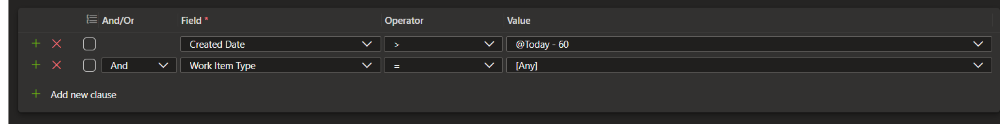

Photo by <a href="https://unsplash.com/@dawson2406?utm_content=creditCopyText&utm_medium=referral&utm_source=unsplash">Stephen Dawson</a> on <a href="https://unsplash.com/photos/turned-on-monitoring-screen-qwtCeJ5cLYs?utm_content=creditCopyText&utm_medium=referral&utm_source=unsplash">Unsplash</a>

# Useful Azure DevOps Boards Queries

A collection of some useful Azure DevOps Boards queries.

# Grooming queries

You will likely want to update the filters on these query to suite your needs, for example by filtering on specific work item types, state etc. What is saved and shown here are just the barebone queries.

**View unparented items**

**View bugs parented under user stories/epics**

⚠️This is a violation of the expected Epic -> Feature -> User story/Bug -> Task hierarchy

**View all work items in the current iteration**

You can also time travel across multiple iteration by adding `+/- count` in front of the `@CurrentIteration`

**View active work that is not assigned to the sprint**

This would likely indicate some previous work that has not been updated or has potentially fallen through the cracks.

**View work items logged in the last x day**s

**View ill defined work items**

The default looks at items with no descriptions, or not acceptance criteria or no story points.

**View work items pending review**

**View unestimated work items**

**View blocked work items**

**View work items that may need to be broken down**
This is determined by high estimates and you can decide on the threshold.

**View stale work items**
You can decide on the time period for this to be considered stale.

**View unassigned items in the current iteration**

**View work items that are due soon**

**View overdue work items**

# Other queries

**View items assigned to me**

**View items that I am following**

**View items where I have recently been mentioned**

Instead of constantly querying the grooming type queries, you can [assign them to a dashboard as charts ](https://learn.microsoft.com/en-us/azure/devops/report/dashboards/add-charts-to-dashboard?view=azure-devops#add-a-work-item-query-or-chart) or as tile widgets so you always have a good view.

💡 In addition to placing charts and other visualization on a dashboard, you can only place these on the query itself. For example you can create a [pivot table](https://learn.microsoft.com/en-us/azure/devops/report/dashboards/configure-chart-work-items-widget?view=azure-devops)) to visualize the data from the query.

Here are recommendations of some great things to visualize
- Bug trends over time
- Task burn down
- Test case pass/fail rate
## Additional tips for working with queries

- Utilize the predefined variables like `@Me`, `@Today`, `@CurrentIterations` etc to your advantage.
- Use tags wisely. These can help filter work items, but if used without disciple they can go out of hand fast. As a general rule, if you have no use case to query by a given tag, you should not be using it. This will keep your tags list clean.
