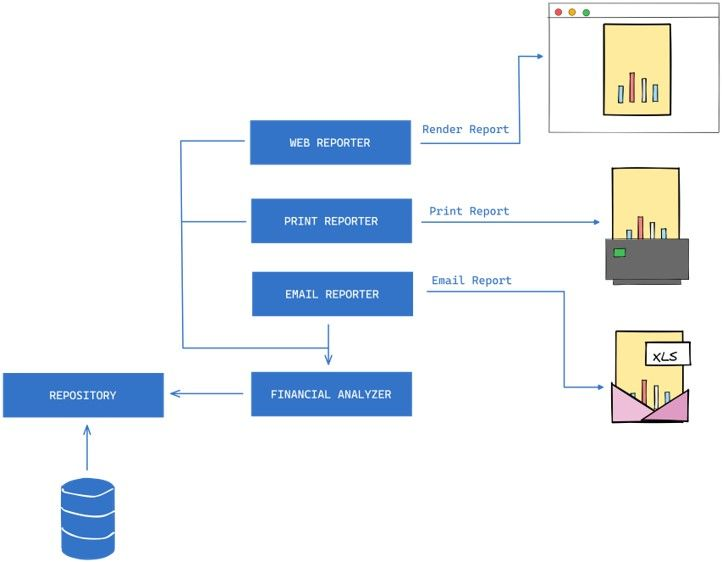
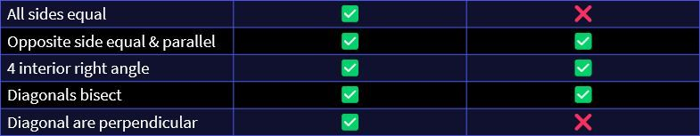
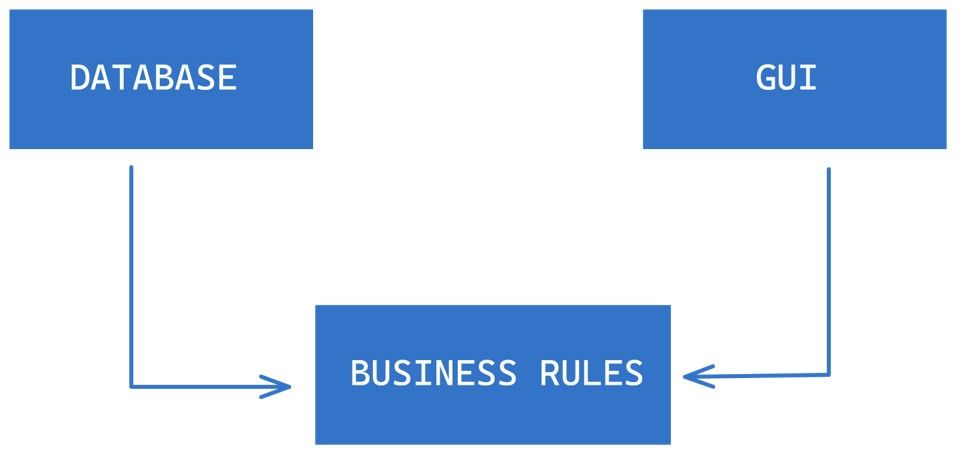

# Clean Architecture

This article summarizes the principles of Clean Architecture based on my own experiences using this architecture in different scenarios. Robert C. Martin's [book](https://www.oreilly.com/library/view/clean-architecture-a/9780134494272/) on this topic was an anchor to my understanding of this topic, especially having discovered the book after working on the architecture for a while. I recently read the book again as a refresher before creating this article and therefore this article serves as a summary of the good parts and additions from my own experiences.

[ChatGPT](https://chat.openai.com/) also played a key role in helping me collect my scattered thoughts on the topic into something more structured and to expand on the content.

# Architecture

When considering architecture, it is crucial to keep in mind several important factors.
- First and foremost, the system's life cycle should be supported, which involves ensuring that it can be maintained, upgraded, and expanded as needed with minimal complications.
- Additionally, the system's lifetime cost should be minimized to keep it viable for as long as possible. A well-designed architecture should also prioritize maximizing programmer productivity by enabling them to work more efficiently and effectively.
- Finally, the architecture should make the operation of the system apparent to developers, who need a clear understanding of how the system works and how it is intended to be used. This is achieved by elevating the use cases, features, and required behaviours of the system to first-class entities that serve as visible landmarks for developers.

It is important to recognize that among all aspects of a software system, maintenance tends to be the most expensive. This is mainly due to two factors: spelunking and risk.


> ©️ Photo by [Bobby Stevenson](https://unsplash.com/@bobbystevenson?utm_source=unsplash&utm_medium=referral&utm_content=creditCopyText) on [Unsplash](https://unsplash.com/photos/lKzNVOHNq0U?utm_source=unsplash&utm_medium=referral&utm_content=creditCopyText)

Spelunking involves the cost of thoroughly examining the existing software to identify the most suitable approach for implementing new features or resolving defects. However, such changes can also raise the risk of inadvertently introducing new defects, thereby contributing to the overall cost.

## Good Architecture

A sound architecture seeks to maintain as many options open for as long as possible. In light of this, it is critical to note that all decisions are trade-offs, and the context plays a pivotal role. An architecture that enables deferring decisions is generally favourable. The elements that require extended options include insignificant details such as database implementation specifics, web services, frameworks, and communication protocols.

Effective architecture renders the system simple to comprehend, develop, maintain, and deploy.

A well-designed architecture should be expressive (screams 😱), drawing attention to critical boundaries and highlighting use cases.

# Important terminology

## Policy vs Details

To ensure clarity in our discussion, it's important to establish some recurring terminology.

In all software systems, two fundamental components can be identified: policy and details.

The policy encompasses all the business rules and procedures that represent the real value of the system.

The details refer to the elements required to interact with the policy but do not have an impact on the policy's behaviour. These may include database implementations, web systems, and communication protocols.

The objective is to prioritize the policy component as the most vital part of the system while ensuring that the details are irrelevant to the policy's behaviour. This approach enables decisions about the details to be postponed.

# Clean Architecture Brief

Clean Architecture aims to create systems that are:

- Independent of frameworks
- Independent of the user interface
- Independent of the database
- Independent of any external agencies for that matter like 3rd party services you may consume via SDKs or APIs
- Testable, more specifically, easily testable
- Easy to understand, build and maintain. It should be easy for developers to comprehend how the system works, and the design should facilitate changes and updates without introducing undue complexity

# S.O.L.I.D principles

To have a complete understanding and appreciation of Clean Architecture, it's crucial to have a solid foundation in certain building blocks. Therefore, we will take a comprehensive approach, beginning with the SOLID principles.

Clean code is fundamental to building effective software systems, and the SOLID principles are instrumental in achieving this goal.

The SOLID principles are a set of guidelines that aim to create modules in a software system that can be changed with minimal cost or friction, are easy to understand, and have a high potential for reuse.

SOLID is an acronym for five principles, which are:

1. Single Responsibility Principle (SRP) - A module should have only one reason to change, meaning it should have only one responsibility.

1. Open/Closed Principle (OCP) - A module should be open for extension but closed for modification. This means that the behaviour of a module can be extended without changing its source code.

1. Liskov Substitution Principle (LSP) - A sub-type should be substitutable for its base type. This means that any object of a base class should be replaceable with an object of its derived class without altering the correctness of the program.

1. Interface Segregation Principle (ISP) - A client should not be forced to implement interfaces they do not use. This means that the interface of a module should be specific to the needs of the client.

1. Dependency Inversion Principle (DIP) - High-level modules should not depend on low-level modules. Both should depend on abstractions. This means that a module should not depend on the details of another module but rather on its abstractions. It's important to note that the emphasis is on inversion and not injection in DIP. We will cover this in more detail later.

## Single Responsibility Principle

The Single Responsibility Principle (SRP) is often misunderstood and incorrectly defined as `A module must do one and only one thing
`. The principle is derived from Conway's law, which suggests that software systems are heavily influenced by the social structures of the organization that uses them.

The correct definition of SRP is that a module should have only one reason to change, meaning that it should only honour one actor. In other words, a module should have a single responsibility, but that responsibility may involve multiple functions.


> ©️ Photo by [Erik Mclean](https://unsplash.com/@introspectivedsgn?utm_source=unsplash&utm_medium=referral&utm_content=creditCopyText) on [Unsplash](https://unsplash.com/photos/qsvQfsSUOgk?utm_source=unsplash&utm_medium=referral&utm_content=creditCopyText)

In the given example, there is a violation of the Single Responsibility Principle, as there is a coupling between concerns from different actors.

```csharp
public class Customer
{
  // data fields

  void CalculateDeliveryCost() {}

  dynamic ReportNextDelivery () {}

  void Save() {}
}
```

The Calculate Delivery Cost function may be intended for the accounting department, which reports to the CFO. The Get Next Delivery Details function may be intended for the delivery department, which reports to the COO. The Save function may be specified by the database administrators who report to the CTO.

The proximity of the code may encourage premature reuse. For example, the calculation of delivery costs may depend on a method that filters deliveries. The delivery team may choose to modify the shared code to exclude deliveries from a collection centre in a postal code that already has other deliveries due on the same day. However, this change may have unintended consequences for accounting, resulting in incorrect reporting and potentially leading to a disgruntled CFO.

This example illustrates the importance of adhering to the Single Responsibility Principle to avoid such coupling of concerns from different actors and the resulting problems.


```csharp
public class Customer
{
    // data fields
}

public interface DeliveryCostCalculator
{
   void CalculateDeliveryCost(Customer customer);
}

public interface IDeliveryReporter
{
   dynamic ReportNextDelivery(Customer customer);
}

public interface IEmployeeRepository
{
   void Save(Customer customer);
}
```

To address the violation of the Single Responsibility Principle in the previous example, one solution could be to adopt an anaemic model, which is favoured in functional programming. In this approach, the behaviour is offloaded from the data, and each component has a single responsibility.

For example, instead of having a Delivery object with methods like CalculateDeliveryCost and GetNextDeliveryDetails, we could have a DeliveryData object that only holds the delivery data and separate classes that handle the behaviours associated with the data.

```csharp
public class CalculateDeliveryCostUseCase
{
    public Execute(IDeliveryCostCalculator deliveryCostCalculator) {}
}

public class ReportNextDeliveryUseCase
{
    public Execute(IDeliveryReporter deliveryReporter) {}
}
```

In the example of using an anaemic model to adhere to the Single Responsibility Principle, we can offload the orchestration of the new moving parts into a use case. The use case is a separate component that is responsible for handling the interactions between the different parts of the system, making the actions explicit and enforcing SRP through a single Execute method.

Although it's possible to directly call through the newly added abstraction, it's often beneficial to use a use case to orchestrate the interactions between the components. This is because use cases are great at handling application-specific concerns and orchestrating complex interactions.

For example, imagine that we want to send emails after the delivery cost is calculated. Ideally, this should not be added to the DeliveryCostCalculator as it can make the component less reusable. A use case is better suited for this scenario as it can handle this application-specific concern without dirtying the DeliveryCostCalculator.

Therefore, services should be kept generic, while use cases can be tailored to specific application needs. By using use cases, we can achieve a more modular, maintainable, and reusable system.

This would result in each component having a single reason to change, making the system more modular and easier to maintain. By offloading the behaviour from the data, we can achieve a more clear separation of concerns and better adhere to the Single Responsibility Principle.

## Open-Closed Principle

The Open/Closed Principle (OCP) states that software systems should be designed to allow for changes in behaviour by adding new code, rather than modifying existing code. The idea is to make the system easy to extend without having a significant impact on the existing codebase.

To achieve this goal, the system should be partitioned into components, and these components should be organized into a dependency hierarchy that protects higher-level components from changes in lower-level components. For instance, the business rules should remain unaffected when switching to a different database implementation.

Would you knock down the Burj Khalifa to install a sewage system? The answer is obviously no! Yet as software engineers, we knock down the Burj Khalifa all the time. This analogy highlights the importance of preserving the existing codebase while still allowing for changes and extensions. A well-designed system should strike a balance between preserving the existing code and allowing for future enhancements. This is where the OCP comes into play, as it provides a guideline for designing systems that are easy to extend without having to modify the existing codebase.


Photo by [Mohit Kumar](https://unsplash.com/@98mohitkumar?utm_source=unsplash&utm_medium=referral&utm_content=creditCopyText) on [Unsplash](https://unsplash.com/photos/6M9xiVgkoN0?utm_source=unsplash&utm_medium=referral&utm_content=creditCopyText)

In the given example, we have an Order class with a method called CalculateTotal, which calculates the total cost of an order. However, the method violates the Open/Closed Principle because it's not closed for modification.

```csharp
public class Order
{
    public decimal CalculateTotal()
    {
        decimal total = 0;
        if (TotalAmount > 1000)
        {
            total -= TotalAmount * 0.05m;
        }
        if (DiscountPercentage > 0)
        {
            total -= TotalAmount * DiscountPercentage / 100;
        }
        return total;
    }
}
```

If we want to add a new type of discount, such as a "buy one, get one free" offer, we would need to modify the CalculateTotal method to include this new type of discount. This violates the OCP because we are modifying existing code rather than extending it.

To adhere to the OCP, we could introduce a Discount class that implements a Discount interface, using the strategy pattern. The Discount interface could have a Calculate method, which calculates the discount based on the order. The CalculateTotal method in the Order class could then be modified to use the Discount interface, allowing for the addition of new discount types without modifying the Order class.

```csharp
public interface IDiscountStrategy
{
    decimal CalculateDiscount(decimal totalAmount);
}

public class Order
{
    public decimal CalculateTotal()
    {
        decimal total = 0;
        if (DiscountStrategy != null)
        {
            total -= DiscountStrategy.CalculateDiscount(TotalAmount);
        }
        return total;
    }
}

public class PercentageDiscountStrategy : IDiscountStrategy
{
    public decimal Percentage { get; set; }
    public decimal CalculateDiscount(decimal totalAmount)
    {
        // calculate the discount for percentage offer
    }
}

public class BuyOneGetOneFreeDiscountStrategy : IDiscountStrategy
{
    public decimal CalculateDiscount(decimal totalAmount)
    {
        // calculate the discount for buy one, get one free offer
    }
}
```

By doing this, we ensure that the Order class is closed for modification and open for extension, as new discount types can be added by implementing the Discount interface, without changing the Order class itself. This makes the system more modular, flexible, and easier to maintain.


Let's look at another violation. In the given example of a reporting service that pulls data out of a database, massages the data, and sends out an email report with an excel file attached, there is a violation of the Open/Closed Principle.


Suppose we want to display the reports on the web or print them out. In that case, we would need to modify the existing code to accommodate these changes, violating the OCP.

To adhere to the OCP, we can introduce a Report class that takes care of generating the report data, and separate ReportFormatter classes for each output format (e.g., EmailReportFormatter, WebReportFormatter, PrintReportFormatter). The ReportFormatter classes implement a ReportFormatter interface that has a format method. The format method takes in the Report data and generates the output in the desired format.

By doing this, we can add new output formats without modifying the existing Report class, making the system closed for modification and open for extension. This approach makes the system more modular, flexible, and easier to maintain.



## Liskov Substitution Principle

The Liskov Substitution Principle (LSP) states that objects of a superclass should be replaceable with objects of its subclasses without affecting the correctness of the program. The principle emphasizes the importance of adhering to a contract that allows the parts to be substituted one for another to build software systems from interchangeable parts.

By following the LSP, we can avoid pollution in the codebase when multiple implementations follow a contract. In other words, we can ensure that different implementations of the same contract behave in the same way, and they can be used interchangeably.

The LSP is particularly important for achieving modularity and ensuring that the system is easy to extend and maintain. By adhering to the principle, we can make sure that the system remains correct and consistent, even as we add new components or modify existing ones.


Photo by [Derek Steen](https://unsplash.com/@djsteen?utm_source=unsplash&utm_medium=referral&utm_content=creditCopyText) on [Unsplash](https://unsplash.com/photos/8SxsQfeKkHY?utm_source=unsplash&utm_medium=referral&utm_content=creditCopyText)

Suppose we have a billing service that generates reports on active licenses, and the service deals with licenses without knowledge of different types of licenses. In this case, different types of licenses can be substituted without affecting the function of the billing service because they all follow the same contract.

For example, we could have different types of licenses, such as `Corporate License`, `Personal License` and `Education License` that implement the same interface or extend the same superclass. As long as they adhere to the contract, they can be used interchangeably, without affecting the correctness of the program.

This is the essence of the LSP: designing software components that follow the same contract, so they can be substituted one for another without affecting the system's correctness or behaviour. By following the LSP, we can ensure that the system is modular, extensible, and easy to maintain.


Consider the case of a Rectangle class with a `SetWidth` and `SetHeight` method, and a Square class that extends Rectangle. Since a square has equal sides, we might be tempted to make the `SetWidth` and `SetHeight` methods override each other to ensure that the sides are always equal. However, doing so violates the LSP, because a square is not a rectangle in the traditional sense, and it doesn't follow the contract of the Rectangle class.


```csharp
// this unit test would fail
var rectangle = new Rectangle(width: 50, height: 20);
rectangle.SetWidth(rect, 100);
rectangle.Height.Should.Be(20);
```



To adhere to the LSP in this case, we could create separate Square and Rectangle classes, each with its own `SetWidth` and `SetHeight` methods. Alternatively, we could introduce an abstract Shape class or interface that defines the common properties and behaviours of both Rectangle and Square, and then have separate implementations for each.

The key takeaway here is that the Liskov Substitution Principle is not just about substituting objects of a superclass with objects of its subclasses; it's also about ensuring that the subclasses follow the same contract as the superclass, without introducing impure inheritance hierarchies. By following this principle, we can ensure that our software systems are modular, flexible, and maintainable.

## Interface Segregation Principle

The Interface Segregation Principle (ISP) advises software designers to avoid depending on things that they don't use. The principle emphasizes the importance of creating simple and focused interfaces that are easier to understand, use, test, and validate.

The ISP states that clients should not be forced to depend on interfaces they do not use. In other words, an interface should only include methods that are relevant to the client. This principle helps to avoid bloated interfaces that carry unnecessary baggage and can cause problems later on.


Photo by [John Barkiple](https://unsplash.com/@barkiple?utm_source=unsplash&utm_medium=referral&utm_content=creditCopyText) on [Unsplash](https://unsplash.com/photos/l090uFWoPaI?utm_source=unsplash&utm_medium=referral&utm_content=creditCopyText)


Suppose we have a Customer Operations class that has information about deliveries and payments. We also have two reporting services, a Delivery Reporting Service that consumes information about deliveries, and a Billing Reporting Service that consumes information about payments. The Customer Operations class has a method that returns all the information, and both reporting services depend on this method.


In this scenario, we have violated the ISP because the reporting services depend on an interface (i.e., the Customer Operations class) that carries baggage they don't use. This means that if we make changes to the Customer Operations class, it can affect the reporting services, even if the changes are unrelated to deliveries or payments.

To fix this, we can introduce two interfaces, IDeliveries and IPayments, that contain only the relevant methods for each reporting service. The Customer Operations class can then implement both interfaces and provide the necessary information to the reporting services via these interfaces.


By doing this, we have eliminated the unnecessary dependencies between the reporting services and the Customer Operations class. The Delivery Reporting Service only depends on the IDeliveries interface, and the Billing Reporting Service only depends on the IPayments interface. This makes the interfaces simple, focused, and relevant to the client, and it also makes the reporting services easier to test and validate.

By creating focused interfaces, we can improve the modularity and flexibility of the system. We can also make the system easier to test and validate since we only need to test the relevant methods. Additionally, focused interfaces can simplify the implementation of the client code since they only need to implement the necessary methods.

Acknowledge this:
- Interfaces that are simple and focused are easier to understand and consume
- Interfaces that are focused on a specific behaviour can be more easily tested


## Dependency Inversion Principle

The Dependency Inversion Principle (DIP) states that high-level modules should not depend on low-level modules, but both should depend on abstractions. This means that the policy (i.e., high-level module) should not depend on the details (i.e., low-level module), but rather the details should depend on the policy.

To adhere to the DIP, we need to program abstractions rather than concretions. This means that we should avoid depending on concrete classes and instead depend on abstractions or interfaces. By doing this, we can make our systems more flexible and maintainable since we can change the implementation of the low-level details without affecting the high-level policies.

The key takeaway from the DIP is that we should program to the interfaces or abstractions, not the implementations. This approach enables us to decouple the modules in our system and create a more flexible and maintainable architecture.


Photo by [Dmitriy Zub](https://unsplash.com/@dimitryzub?utm_source=unsplash&utm_medium=referral&utm_content=creditCopyText) on [Unsplash](https://unsplash.com/photos/jibUsRaauLY?utm_source=unsplash&utm_medium=referral&utm_content=creditCopyText)

The analogy of the excavator is a good illustration of how the DIP works in practice. By depending on the abstract concept of a fixture rather than a specific fixture, the excavator can be easily adapted to different tasks without having to replace the entire machine. This approach enables us to reuse the excavator and make it more flexible and adaptable to different situations. If this were violated, imagine having to get a new excavator each time a task requires a different fixture.

Suppose we have an application host, such as a console application or web application, that depends on an application core. The application core contains the business logic or policy of the system. However, the application core also depends on a CRM SDK, which is an implementation detail or infrastructure concern.


In this scenario, we have violated the DIP because the application core depends on the details of the CRM SDK. This makes the system less flexible and harder to maintain since any changes to the CRM SDK could affect the application core and the application host.

To fix this, we can introduce an interface, such as `ICustomerLeadsRepo`, that defines the methods for creating, updating, and adding notes to customer leads. The application host can own or define this interface since it needs to interact with the CRM SDK. The application core can then depend on this interface instead of the CRM SDK directly.


By doing this, we have inverted the dependency and made the system more flexible and maintainable. The application host can now provide the necessary details to the application core via the ICustomerLeadsRepo interface, and the CRM SDK can implement this interface without affecting the application core or the application host.

In summary, the DIP is about inverting the dependency between high-level policies and low-level details by programming to abstractions rather than concretions. By doing this, we can create a more flexible and maintainable system that can adapt to changes in the implementation details without affecting the high-level policies.

## Component Principles

Now that we have covered the SOLID principles that operate at the module level, let us move a level higher, to components.

The SOLID principles operate at the module level, while the principles of component design operate at a higher level of abstraction. Three principles of component design are important:

Reuse/Release Equivalence Principle: This principle states that classes and modules that are grouped into a component should be releasable together. This means that if you want to reuse a particular component in another project, you should be able to release that component without having to release any other unrelated components.

1. Common Closure Principle: This principle states that we should group those classes that change for the same reasons and at the same time. In other words, we should create components that have high cohesion and low coupling. This principle is similar to the Single Responsibility Principle but operates at the component level.

1. Common Reuse Principle: This principle states that we should not force users of a component to depend on things they don't need. This means that we should create components that are highly cohesive and loosely coupled so that users can easily reuse specific parts of the component without having to depend on other unrelated parts.

1. The Reuse/Release Equivalence Principle and the Common Closure Principle are inclusive principles, while the Common Reuse Principle is not. Together, these principles help to create components that are easy to understand, easy to modify, and easy to reuse.


The three principles of component design create a tension between the need for reuse, the need for maintainability, and the need to avoid forcing users to depend on things they don't need. The optimal position in this tension triangle will depend on the current concerns of the development team and the project's current stage of development.

Early in the development of a project, the focus is often on developability, so the Common Closure Principle (CCP) is more important than the Reuse/Release Equivalence Principle (REP) or the Common Reuse Principle (CRP). As the project matures, the focus may shift towards reuse, and the team may prioritize the REP and CRP over the CCP.

Ultimately, the value of these principles lies in their ability to create components that are easy to understand, easy to modify, and easy to reuse. By following these principles, developers can create software systems that are flexible and adaptable to changing requirements and can be easily maintained over time.

## Stable Dependencies Principle

Stability in software components refers to how difficult it is to make changes to that component without affecting other parts of the system. A stable component is less likely to change, and thus less likely to cause cascading changes throughout the system.

It is generally better to depend on stable components than on unstable ones. If a component is unstable, it may change frequently and cause cascading changes in dependent components, leading to more maintenance work and potential issues. On the other hand, stable components are less likely to change frequently and can provide a more reliable foundation for the software system.


The formula for calculating stability is

`I = Fan-out / (Fan-out + Fan-in)`

where Fan-out refers to the number of outgoing dependencies and Fan-in refers to the number of incoming dependencies.

Modules with a high value of I (close to 1) have many outgoing dependencies and few incoming dependencies, making them more unstable and easier to change. On the other hand, modules with a low value of I (close to 0) have few outgoing dependencies and many incoming dependencies, making them more stable and harder to change.

Software stability refers to the difficulty of making changes to a component. This can be affected by factors such as size, complexity, and clarity. One way to make a component hard to change is to have many other components depending on it. Such a component with many incoming dependencies is considered stable because any changes made to it would require a lot of work to reconcile with all the dependent components. The key rule to follow is to depend in the direction of stability, meaning that components with more incoming dependencies should be depended on by components with fewer incoming dependencies.

The key takeaway is to depend on more stable components, as they are less likely to change and cause ripple effects throughout the system.


Visually looking at this we can say the first labelled component is maximally stable as it has no outgoing dependencies but has a lot of incoming dependencies. Inversely the second labelled component is unstable.

We want to strike a balance between stability and changeability in our software system. If all components were highly stable, the system would become rigid and resistant to change, making it difficult to adapt to new requirements or fix issues. On the other hand, if all components were highly changeable, the system would become unstable and unreliable, making it difficult to ensure its correctness and maintainability over time.

Therefore, we need to design our component structure so that some components are more stable and others are more changeable, depending on their role in the system. And we should always try to depend in the direction of stability so that changes to unstable components don't ripple through the entire system and cause unintended consequences.

The previously stable component, as shown below, is no longer stable as it now has an outgoing dependency on an unstable component. Remember our rule, always depend in the direction of stability.


We can employ the Dependency Inversion Principle to fix this violation by introducing an abstraction in between as shown below.


Below is a more real-world example of respecting the dependencies rules, by ensuring that our business rules, the policy, do not depend on the details but instead the details depend on the policy.



## Clean Architecture

Finally, let's talk about Clean Architecture. Let's jump right in with some visuals. Were are going to introduce some concentric circles that represent key areas of our software and show how Clean Architecture expects dependencies on these to work.

Starting with the most stable, we would have what is critical to our operations, the entities that hold critical business rules.


Next, the Use Cases represent the application-specific business rules that are responsible for orchestrating the flow of information and actions between different components in the system. These rules are typically specific to a given application and may involve many moving parts, including entities, interfaces, and other components.

In the architecture diagram, the Use Cases are shown as being dependent on the entities, which contain the critical business rules that underpin the entire system. Notice the direction of the arrow, which indicates that the Use Cases depend on the entities, but the entities do not depend on the Use Cases.

This direction of the arrow is important because it represents the direction of stability in the system. As we move in the diagram from lower-level components to higher-level ones, the components become more abstract and less volatile. This means that they are less likely to change and are therefore more stable.

Conversely, as we move out of the diagram from higher-level components to lower-level ones, the components become more concrete and more volatile. This means that they are more likely to change and are therefore less stable.

In general, the arrows in the architecture diagram should always point in the direction of stability, with higher-level components depending on lower-level ones. This helps to ensure that the system remains stable and resilient to change over time.


Next up, we have the Interface Adapters.

These adapters are responsible for converting incoming formats from the outside world into formats that are convenient for the use cases, and vice versa. They are the bridge between the higher-level use cases and the lower-level details of the outside world, such as database implementations, SDKs, APIs, user interfaces, I/O, and more.

As with the other components, the direction of dependencies in the Interface Adapters layer should always point in the direction of stability. In this case, the adapters should depend on the interfaces defined by the use cases, and not the other way around.

The Interface Adapters layer serves as a buffer between the highly volatile and specific external technologies and the stable use cases, allowing the system to evolve without being too tightly coupled to any particular external technology.


In the outermost layer of Clean Architecture, we have the outside world which represents the low-level details such as the database, SDKs, APIs, User Interfaces, and IO. The arrows always point in the direction of stability, with the more inward direction indicating higher-level software and the more outward direction indicating lower-level software.


It's important to note that the source code dependencies must only point inward towards stability, and violating this rule can result in a code smell. When the name of something in an outer circle is mentioned in an inner circle, or when data formats from an outer circle are used in an inner circle, it can be a sign that this rule is being violated.

What about the flow of control? The flow of control should always follow the flow of dependencies. If a use case needs to call an external system or service, it should not do so directly because that would violate the Dependency Rule. Instead, the use case should call an interface or port defined in the outer layer of the architecture, and the implementation of that interface in the outer layer should handle the interaction with the external system or service.

Similarly, if an external system or service needs to call into the system, it should do so through an interface defined in the outer layer. This technique ensures that all dependencies in the architecture flow inwards, towards the more stable and abstract layers, and that no component in an inner layer depends directly on a component in an outer layer.

Overall, the goal is to use dynamic polymorphism to create source code dependencies that allow for flexibility and extensibility while conforming to the Dependency Rule, regardless of the direction of the flow of control.

### But I am doing this already

This may look familiar even if you are new to it, but that can be very misleading

The layers may look like the classic n-tier layers, but the flow of dependencies is different

If you are not explicitly implementing clean architecture or at the very least if you are not concerned about solving the same challenges addressed by the clean architecture you are probably doing the classic n-tier.


N-tiered architecture violates the Dependency Rule because the business logic layer knows about the data access and other infrastructure concerns, which means that high-level policies are dependent on low-level details. This violates the flow of dependencies and can lead to an unstable and difficult-to-maintain system. Clean Architecture, on the other hand, promotes a strict flow of dependencies where high-level policies depend only on abstractions and low-level details depend on high-level policies. This creates a more stable and maintainable system that is easier to change over time

### Onion Architecture and Ports & Adapters

Different architectural patterns can be used to achieve the same goal of separating concerns and dependencies in a software system. The onion architecture, ports and adapters, and clean architecture are examples of such patterns.


> ©️ Image by Mark Seeman on [his blog](https://blog.ploeh.dk/2013/12/03/layers-onions-ports-adapters-its-all-the-same/)

While they may differ in their visualization and terminology, they share the same underlying principles and concepts. It's perfectly fine to appreciate and have a preference for one over the other.

I prefer the clean architecture as it provides a clear visualization of the different layers and their dependencies, which is backed by Uncle Bob's book. However, I also find the terminology used in Ports and Adapters to be more explicit in describing the different components and their roles. Therefore, I may subtly introduce such terminology in my explanation going forward.

## Specifics on some of the software layers

What else belongs in the domain core?

- Interfaces
- Aggregate Roots
- Value Objects
- Entities
- Domain Services/ Use Cases
- Domain Exceptions
- Domain Events
- Event Handlers
- Validators
- Enums

What else belongs in the infrastructure?

- Repositories
- Db Context classes
- API Clients
- File System Access
- Cloud Service Access
- Email Clients
- SMS Clients
- System Clocks
- SDK types
- Identity

## Summary

Following these simple rules we have discussed so far is not a challenging task, and it can save you a lot of trouble in the future.

By dividing your software into layers and abiding by the Dependency Rule, you will establish an inherently testable system, with all the advantages this entails.

If any external parts of the system become outdated, such as the database implementation or the web framework, you can easily replace those obsolete elements with a minimum of fuss.

Furthermore, you can lift and shift modules with ease. Your critical business rules, or your application business rules, can be reused in similar applications that may use different low-level details, such as varying technology implementations. For example, the same application core in a web API can be reused in a desktop application, as is.

The same applies to the External agency implementations, the infrastructure, or adapters. The infrastructure implementations derived from clean architecture, such as API clients, would have no business rules knowledge and thus can be used in entirely different applications, as it.

The million-dollar question is whether you can break these rules and still be following clean architecture principles. I firmly believe that you cannot, particularly the dependencies flow. The benefits of this architecture stem from its purity. This is not to say that it is a rigid architecture; there is a lot of flexibility built into it. However, the Dependency Rule is an absolute must.


Photo by [Tingey Injury Law Firm](https://unsplash.com/@tingeyinjurylawfirm?utm_source=unsplash&utm_medium=referral&utm_content=creditCopyText) on [Unsplash](https://unsplash.com/photos/veNb0DDegzE?utm_source=unsplash&utm_medium=referral&utm_content=creditCopyText)

> ⚠️ The above is a very bold remark but very good advice. Once you have a firm understanding of this and have respected the rules enough to gain experience you will stumble upon interesting scenarios that may require trade-offs, like the classic EF Core problem in . NET. You can make a trade-off and break the rule(s), but tread with care.

What if I grossly violate the rules anyway, what could go wrong?

Then you choose pain or sorts:
- You choose to marry frameworks
- You choose to marry the UI technology
- You choose to marry the database
- You choose to end up with something that is not testable
- You choose to deal with occasional cyclic dependency issues
- You choose developer spelunking

  Must I remind you of your speluncaphobia, agoraphobia and mazeophobia? You can’t handle spelunking.
- You choose to forfeit the ability to lift and shift
- You choose productivity that is ever-decreasing with each new feature.

🛑 That is a lot of baggage to take on


## Code Demo (C#)

To see Clean Architecture at play let us run with a scenario where we are creating a voucher system for a retail company. Initially, the requirement is to be able to generate vouchers that can be applied for free delivery. It should be possible to validate and redeem these vouchers, with the latter only being possible once.

We want to be able to store these vouchers but we are not sure about the details yet so we want to defer this requirement. As for generating the vouchers we have identified [shortid](https://github.com/bolorundurowb/shortid/) as the library that we shall be using. For this example, let us assume this is a complex integration.

Let us start with identifying the inner circle, the domain entities.

```csharp
public record struct Voucher(string Code, VoucherType Type, Discount Discount, bool Shareable, bool Redeemed)
{
    public static Voucher NewVoucher(string code, VoucherType type, DiscountType discountType, float value,
        bool shareable)
    {
        var discount = Discount.Create(discountType, value);

        return new(
            code,
            type,
            discount,
            shareable,
            false
        );
    }

    public void Redeem() => Redeemed = false;
}

public readonly record struct Discount(DiscountType DiscountType, float Value)
{
    public static Discount Create(DiscountType discountType, float value) => new(
        discountType,
        value
    );
}

public enum DiscountType
{
    Unknown,
    Amount,
    Percentage
}

public enum VoucherState
{
    Unknown,
    AlreadyRedeemed,
    Valid,
    NotFound
}

public enum VoucherType
{
    Unknown,
    Delivery
}
```

The `Voucher` structure defines a public record with five properties: `Code`, `Type`, `Discount`, `Shareable`, and `Redeemed`. The `Code` property is a string that holds the unique identifier for a voucher, `Type` holds the type of voucher, `Discount` holds the discount applied by the voucher, `Shareable` indicates if the voucher can be shared, and `Redeemed` is a boolean indicating if the voucher has been used or not. Additionally, the `Voucher` structure has a static method named `NewVoucher` that takes in a `code`, `type`, `discountType`, `value`, and `shareable` parameter and returns a new `Voucher` object.

The `Discount` structure defines a public read-only record with two properties: `DiscountType` and `Value`. The `DiscountType` property is an enum that defines the type of discount (Amount or Percentage), and `Value` is the amount of the discount applied.

There are three enums defined in this code: `DiscountType`, `VoucherState`, and `VoucherType`. `DiscountType` has three values: `Unknown`, `Amount`, and `Percentage`, which are used to define the type of discount applied by a voucher. `VoucherState` has four values: `Unknown`, `AlreadyRedeemed`, `Valid`, and `NotFound`, which represent the state of a voucher. `VoucherType` has two values: `Unknown` and `Delivery`, which define the type of voucher.

In addition to the structures and enums, there is a method defined within the `Voucher` structure named `Redeem()`. This method sets the `Redeemed` property of a `Voucher` object to `true`.

Overall, this code provides us with a basic framework for working with vouchers, discounts, and their state as required by our client.

Next let us move to the next circle, the application. We shall require use cases that honour the expected behaviour, namely:
- Generating a new voucher
- Redeeming a voucher
- Validating a voucher

Before diving into the details of these use cases, we can already identify that the use cases will need to trigger infrastructure. For example, the use cases will need to read, create or update voucher entries that we are storing and the generate voucher use case specifically will need to generate a new voucher code.

If we were to have a direct dependency on infrastructure, this would validate our dependencies rule, which states, always depend in the direction of stability. We can apply Dependency Inversion in our favour to make the application own and define the contracts that should then be honoured by the infrastructure. Our use cases can then depend on and consume these contracts, hence not depending on something volatile, and in turn, our infrastructure can depend on and implement these contracts.

Let's look at what these contracts could look like

```csharp
public interface IVoucherGenerator
{
    Task<string> GenerateNewCode(CancellationToken cancellationToken = default);
}

public interface IVoucherRepository
{
    Task Upsert(Voucher voucher, CancellationToken cancellationToken = default);

    Task<bool> TryGetVoucher(string code, out Voucher? voucher, CancellationToken cancellationToken = default);
}
```

The first interface `IVoucherGenerator` defines a single method `GenerateNewCode` that takes in an optional `CancellationToken` and returns a `Task<string>`. This method is responsible for generating a new voucher code and returning it as a `string`. The `CancellationToken` parameter is optional and allows for the cancellation of the task if needed.

The second interface `IVoucherRepository` defines two methods `Upsert` and `TryGetVoucher`. The `Upsert` method takes in a `Voucher` object and an optional `CancellationToken` and returns a `Task`. This method is responsible for inserting or updating a voucher in the repository. The `CancellationToken` parameter is optional and allows for the cancellation of the task if needed.

The `TryGetVoucher` method takes in a `string` representing a voucher code, an `out` parameter voucher of type `Voucher?` and an optional `CancellationToken`. This method is responsible for retrieving a voucher from the repository if it exists, assigning it to the voucher parameter and returning true. If the voucher does not exist, it returns false. The `CancellationToken` parameter is optional and allows for the cancellation of the task if needed.

Overall, these interfaces provide the necessary contracts for voucher generation and repository operations. By implementing these interfaces in classes, the code can be decoupled and modular, allowing for flexibility and maintainability. The `IVoucherGenerator` and `IVoucherRepository` interfaces can be used together to generate, store and retrieve vouchers, allowing the rest of the codebase to interact with vouchers without worrying about the implementation details of voucher generation and storage.

Now that we have defined the contracts, let's look at the use cases.

```csharp
public record GenerateVoucherRequest(VoucherType VoucherType, DiscountType DiscountType, float Value, bool Shareable)
{
    public static GenerateVoucherRequest ForFreeDelivery() => new(
        VoucherType.Delivery,
        DiscountType.Percentage,
        100,
        true
    );
}

public class GenerateVoucherUseCase
{
    private readonly IVoucherGenerator _voucherGenerator;
    private readonly IVoucherRepository _voucherRepository;

    public GenerateVoucherUseCase(IVoucherGenerator voucherCodeGenerator, IVoucherRepository voucherRepository)
    {
        _voucherGenerator = voucherCodeGenerator ?? throw new ArgumentNullException(nameof(voucherCodeGenerator));
        _voucherRepository = voucherRepository;
    }

    public async Task<Voucher> Handle(GenerateVoucherRequest request, CancellationToken cancellationToken = default)
    {
        var voucherCode = await _voucherGenerator.GenerateNewCode(cancellationToken);

        var voucher = Voucher.NewVoucher(voucherCode,
            request.VoucherType,
            request.DiscountType,
            request.Value,
            request.Shareable);

        await _voucherRepository.Upsert(voucher, cancellationToken);

        return voucher;
    }
}

public record RedeemVoucherRequest(string Code);

public record RedeemVoucherResponse(bool IsValid, Voucher? Voucher)
{
    public static RedeemVoucherResponse Valid(Voucher voucher) => new(
        IsValid: true,
        voucher
    );

    public static RedeemVoucherResponse Invalid(Voucher? voucher) => new(
        IsValid: false,
        voucher
    );
}

public class RedeemVoucherUseCase
{
    private readonly IVoucherRepository _voucherRepository;

    public RedeemVoucherUseCase(IVoucherRepository voucherRepository) => _voucherRepository = voucherRepository;

    public async Task<RedeemVoucherResponse> Handle(RedeemVoucherRequest request,
        CancellationToken cancellationToken = default)
    {
        var exists = await _voucherRepository.TryGetVoucher(request.Code, out var existingVoucher, cancellationToken);

        if (!exists)
            return RedeemVoucherResponse.Invalid(voucher: null);

        if (existingVoucher!.Value.Redeemed)
            return RedeemVoucherResponse.Invalid(existingVoucher);

        await RedeemVoucher(existingVoucher.Value);

        return RedeemVoucherResponse.Valid(existingVoucher.Value);
    }

    // If this logic is used elsewhere, ideally this would be another use case
    private async Task RedeemVoucher(Voucher existingVoucher)
    {
        existingVoucher.Redeem();

        await _voucherRepository.Upsert(existingVoucher);
    }
}

public record ValidateVoucherRequest(string Code);

public record ValidateVoucherResponse(VoucherState State, Voucher? Voucher = null)
{
    public static ValidateVoucherResponse NotFound() => new(
        VoucherState.NotFound
    );

    public static ValidateVoucherResponse Valid(Voucher voucher) => new(
        VoucherState.Valid,
        voucher
    );

    public static ValidateVoucherResponse AlreadyRedeemed(Voucher voucher) => new(
        VoucherState.AlreadyRedeemed,
        voucher
    );
}

public class ValidateVoucherUseCase
{
    private readonly IVoucherRepository _voucherRepository;

    public ValidateVoucherUseCase(IVoucherRepository voucherRepository) => _voucherRepository =
        voucherRepository ?? throw new ArgumentNullException(nameof(voucherRepository));

    public async Task<ValidateVoucherResponse> Handle(ValidateVoucherRequest request,
        CancellationToken cancellationToken = default)
    {
        var exists = await _voucherRepository.TryGetVoucher(request.Code, out var existingVoucher, cancellationToken);

        if (!exists)
            return ValidateVoucherResponse.NotFound();

        return existingVoucher!.Value.Redeemed
            ? ValidateVoucherResponse.AlreadyRedeemed(existingVoucher.Value)
            : ValidateVoucherResponse.Valid(existingVoucher.Value);
    }
}
```

The above defines three use cases related to voucher generation, redemption, and validation.

The `GenerateVoucherUseCase` class implements a use case for generating a new voucher. The class takes in an `IVoucherGenerator` and an `IVoucherRepository` object through its constructor. The `Handle` method of the class takes in a `GenerateVoucherRequest` object and an optional `CancellationToken`. The method generates a new voucher code using the `IVoucherGenerator` object, creates a new `Voucher` object using the `Voucher.NewVoucher` static method, and stores the voucher in the repository using the `IVoucherRepository.Upsert` method. The method returns the generated voucher.

The `RedeemVoucherUseCase` class implements a use case for redeeming a voucher. The class takes in an `IVoucherRepository` object through its constructor. The `Handle` method of the class takes in a `RedeemVoucherRequest` object and an optional `CancellationToken`. The method uses the `IVoucherRepository.TryGetVoucher` method to check if the voucher exists in the repository and is not already redeemed. If the voucher is valid, the method calls the `Redeem` method of the `Voucher` object, sets the `Redeemed` property to `true`, and stores the voucher in the repository using the `IVoucherRepository.Upsert` method. The method returns a `RedeemVoucherResponse` object indicating whether the voucher was successfully redeemed.

The `ValidateVoucherUseCase` class implements a use case for validating a voucher. The class takes in an `IVoucherRepository` object through its constructor. The `Handle` method of the class takes in a `ValidateVoucherRequest` object and an optional `CancellationToken`. The method uses the `IVoucherRepository.TryGetVoucher` method to check if the voucher exists in the repository and is not already redeemed. The method returns a `ValidateVoucherResponse` object indicating whether the voucher is valid, already redeemed or not found.

That concludes the application concerns. Next, let us move to the infrastructure by implementing the contracts defined in the application.

```csharp
internal class VoucherRepository : IVoucherRepository
{
    private readonly InMemoryStore<Voucher> _inMemoryStore = new();

    public Task Upsert(Voucher voucher, CancellationToken cancellationToken = default)
    {
        _inMemoryStore.Add(voucher);

        return Task.CompletedTask;
    }

    public Task<bool> TryGetVoucher(string code, out Voucher? voucher, CancellationToken cancellationToken = default)
    {
        voucher = _inMemoryStore.TryGet(vouchers => vouchers.SingleOrDefault(x => x.Code.Equals(code)));

        return Task.FromResult(!(voucher is null));
    }
}

internal class InMemoryStore<T>
{
    private readonly ConcurrentBag<T> _store = new();

    public void Add(T item) => _store.Add(item);

    public T TryGet(Func<IEnumerable<T>, T> selector) => selector(_store.AsEnumerable());
}

public class PersistenceAdapter
{
    private ServiceProvider _serviceProvider;

    public PersistenceAdapter()
    {
        SetupAdapterContainer();
    }

    public void Initialize(IServiceCollection services) =>
        services.AddScoped(x => _serviceProvider.GetService<IVoucherRepository>());

    public void SetupAdapterContainer()
    {
        var services = new ServiceCollection();
        services.AddSingleton<IVoucherRepository, VoucherRepository>();

        _serviceProvider = services.BuildServiceProvider();
    }
}
```

The above defines an in-memory store and an adapter class for persistence operations.

The `VoucherRepository` class implements the `IVoucherRepository` interface and uses an in-memory store to add and retrieve voucher objects. The class has a private instance of `InMemoryStore<Voucher>` class and two public methods: `Upsert` and `TryGetVoucher`.

The `InMemoryStore<T>` class is a generic class that provides an in-memory store for any type of object. The details are not of particular importance. The key thing here is that we could defer the decision of implementing a data store, which could have been a database, file storage, blob storage, etc, by implementing a trivial in-memory store. Once we have enough context to make this decision, all we need to do is implement a new concrete implementation of the interface and once tested and ready, simply swap the previous for the new in our bootstrapping.

The `PersistenceAdapter` class is a simple adapter class that initializes and sets up the IVoucherRepository object using the VoucherRepository class.

Overall, these classes provide a basic framework for implementing persistence operations.


```csharp
internal class CodeGenerator : IVoucherGenerator
{
    private readonly VoucherGeneratorAdapterOptions _options;

    public CodeGenerator(VoucherGeneratorAdapterOptions options)
    {
        _options = options ?? throw new ArgumentNullException(nameof(options));
    }

    public Task<string> GenerateNewCode(CancellationToken cancellationToken = default) =>
        Task.FromResult(ShortId.Generate(
            new GenerationOptions
            {
                Length = _options.Length,
                UseNumbers = _options.UseNumbers,
                UseSpecialCharacters = _options.UseSpecialCharacters
            }));
}

public class VoucherGeneratorAdapterOptions
{
    public int Length { get; set; }
    public bool UseNumbers { get; set; }
    public bool UseSpecialCharacters { get; set; }
}

public class VoucherGeneratorAdapter
{
    private ServiceProvider _serviceProvider;

    public VoucherGeneratorAdapter(VoucherGeneratorAdapterOptions options)
    {
        SetupContainer(options);
    }

    public void Initialize(IServiceCollection services) =>
        services.AddScoped(x => _serviceProvider.GetService<IVoucherGenerator>());

    private void SetupContainer(VoucherGeneratorAdapterOptions options)
    {
        var services = new ServiceCollection();
        services.AddSingleton(options);
        services.AddSingleton<IVoucherGenerator, CodeGenerator>();

        _serviceProvider = services.BuildServiceProvider();
    }
}
```

The defines a code generator class and an adapter class for generating voucher codes.

The `CodeGenerator` class implements the `IVoucherGenerator` interface and uses a third-party library called `ShortId` to generate short, unique, and random voucher codes. The class takes in a `VoucherGeneratorAdapterOptions` object through its constructor, which specifies the length of the code, whether to use numbers, and whether to use special characters. The class has a single public method, `GenerateNewCode`, that returns a new voucher code as a string wrapped in a Task object.

The `VoucherGeneratorAdapter` class is an adapter class that initializes and sets up the `IVoucherGenerator` object using the `CodeGenerator` class.

Overall, these classes provide a basic framework for generating voucher codes using the `ShortId` library.

We have all the moving parts, what about the project structure? This is quite flexible, and a decision you can make based on your project context or preferences and can leverage onto other patterns and practices you may be using like CQRS (Command Query Responsibility Segregation), DDD (Domain Driven Design), Vertical Slices etc. The key thing is however to continue to respect the dependencies' rules. Let us look at an example project structure.


We can observe that Domain is maximally stable as it has no outgoing dependencies but has incoming dependencies, which is desirable as this is our policy. Next, we have the Application that knows of the Domain, followed by two adapters VoucherGenerator and Persistence that know of the Domain, hence transitively know of the Domain. Lastly, we have a Web Host that knows of both adapters, as it needs to bootstrap them, and therefore transitively knows of everything. This know-all scenario is expected for Application Hosts and Tests.

Let's observe this again but with transitive references shown.


The resulting solution structure looks as follows.


We can visualize what we have in code as follows


If we draw concentric circles based on that visualization with the various software levels, we would end up with the following


That means we have satisfied Clean Architecture in our implementation 😃.

# Tests

What about tests?

Tests are an essential part of software development and they follow the Dependency Rule just like any other component of the system. They always depend inward towards the code being tested and nothing within the system depends on the tests. This makes them the outermost layer of Clean Architecture.


If the system architecture is centred around the use cases and the frameworks are kept at arm's length, it should be possible to unit-test all the use cases without any frameworks in place. This is because tests are concrete and detailed, and they follow the Dependency Rule, making them easy to control.

One advantage of tests is their flexibility in skipping boundaries. This allows developers to choose the type of tests to author, depending on the needs of the system. The combination of Inversion of Dependencies and Dependency Injection gives developers full control of this.

In the case of the demo sample, developers could opt for integration tests that test at the API level. They could choose to use real dependencies for their infra implementation, mock them, or use doubles like an in-memory implementation. The same applies to unit tests, where developers can employ mocking or doubles to make the process easier.

Clean Architecture doesn't necessarily empower developers with things like end-to-end tests, but it also doesn't hinder them. Developers can still write contract tests, behaviour-driven tests, targeted integration tests, and more.

When a clean architecture is not followed, tests may not be integrated into the design as a first-class citizen. This leads to difficulties in testing and fragile tests. In such cases, tests are likely to be strongly coupled to the system being tested, making it challenging to maintain and change the system.

A clear indication of a poorly designed test system is the strong coupling between tests and the system components. Such tightly coupled tests must change along with the system. Even a minor modification to a component can cause many dependent tests to break or require modifications.

It is essential to understand that tests are not separate from the system being tested. Instead, they are integral parts of the system and must be well-designed to provide the benefits of stability and regression testing. Therefore, it is crucial to adhere to clean architecture principles to ensure that tests are appropriately integrated into the system design. By doing so, testing can be more effective, and changes to the system can be made with greater ease and confidence.

# Summary

Give Clean Architecture a try and evaluate for yourself the claims it makes. Overall, however, we can summarize as follow:

- Clean Architecture is good for long-term software life

- Clean Architecture is good for stability and maintainability

- Clean Architecture is good testability

- The stability, maintainability and testability of your software are good for your long-term health

# Recommended Reading

- [Clean Architecture – Uncle Bob](https://www.oreilly.com/library/view/clean-architecture-a/9780134494272/)

- [Patterns of Enterprise Application Architecture – Martin Fowler](https://www.martinfowler.com/books/eaa.html)

- [Domain Driven Design - Eric Evans](https://www.domainlanguage.com/ddd/blue-book/)

- [12 Factor Application Principles](https://12factor.net/)

- CQRS (Command Query Responsibility Segregation)

- Acyclic Dependencies Principle

- Stable Abstractions Principle

- SOLID + GRASP Principles
