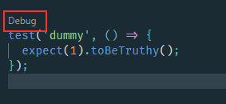

Photo by <a href="https://unsplash.com/@nina_mercado?utm_source=unsplash&utm_medium=referral&utm_content=creditCopyText">Nina Mercado</a> on <a href="https://unsplash.com/photos/Y_t0n-T4H5M?utm_source=unsplash&utm_medium=referral&utm_content=creditCopyText">Unsplash</a>

Debugging Jest tests in Visual Studio Code can greatly enhance your JavaScript testing experience. While I am an avid user of the vscode-jest extension, which is incredibly lightweight and encompasses all the primary features needed for efficient testing, there's one aspect I felt was missing: the ability to debug all tests, regardless of their state.

Fortunately, customizing VS Code to enable debugging for all Jest tests, including those that pass, fail, or are in an unknown state, is quite straightforward. You simply need to modify the settings.json file in the .vscode directory of your project. By adding or updating this configuration file with the following snippet, you unlock the ability to debug every test

```json
{
  "jest.debugCodeLens.showWhenTestStateIn": ["fail", "pass", "unknown"]
}
```

With this simple addition, you can now trigger the debugger for tests in any state. This flexibility is particularly useful for thoroughly examining test executions, ensuring that your JavaScript code behaves as expected under various scenarios. It's a small tweak, but it significantly improves the debugging capabilities within VS Code, making the process of testing with Jest more efficient and comprehensive. Sweet!


