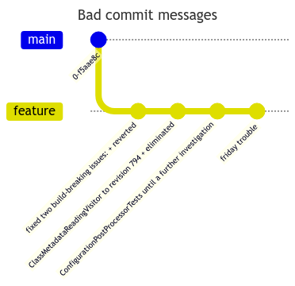
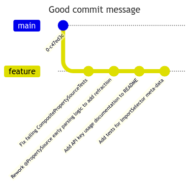
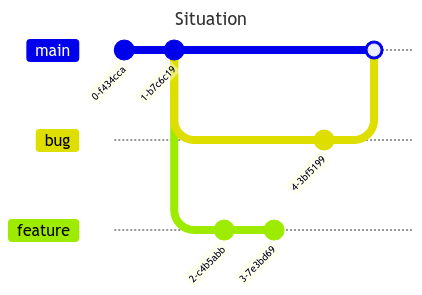
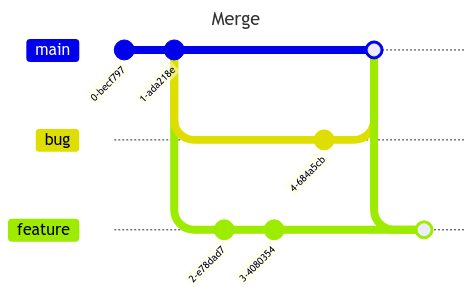
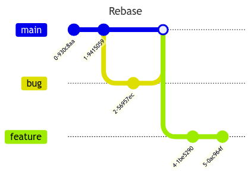
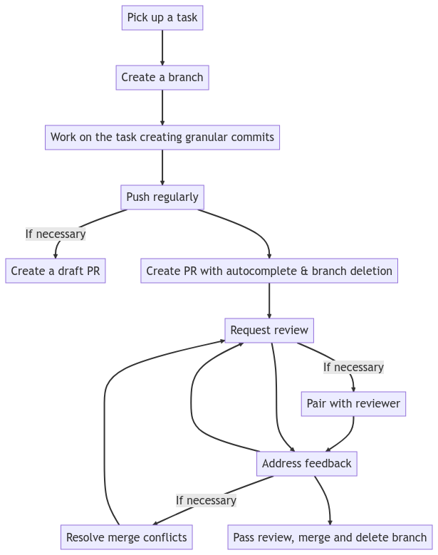

Photo by <a href="https://unsplash.com/@yancymin?utm_source=unsplash&utm_medium=referral&utm_content=creditCopyText">Yancy Min</a> on <a href="https://unsplash.com/photos/842ofHC6MaI?utm_source=unsplash&utm_medium=referral&utm_content=creditCopyText">Unsplash</a>

# Effective Git Management Guide

## Commits

✅ **DO** push your commits often, in case `Murphy's Law decides to visit`.

✅ **DO** break your work into smaller, logical pieces as commits.

This helps with:

- Making it possible to cherry pick and revert specific changes
- Makes `git blame` easier when trying to track a change, especially around bug fixes, which will then tie nicely with a matching commit message
- Making it possible to review code by commits which can be useful for large Pull Requests

Overall, this approach helps maintain a clean and understandable commit history, making it easier to track the origin of changes and simplifying the review process.

✅ **DO** ensure each commit makes a single, focused change.

✅ **DO** use clear and descriptive commit messages that explain the purpose and effect of the change.

✅ **DO** use the imperative verbs/mood in the subject line. Use a consistent style for your commits, such as starting with a verb and using the present tense.





> The idea is that instead of a commit message saying what has been done, it should be read as this is what will happen when the commit is applied. Commit messages should read like chapters in a book, the book being the unit of work that will result in a Pull Request.

## Branches Management

✅ **DO** use a well-defined branching strategy like GitFlow or GitHub Flow to manage the development process effectively and keep the main branch stable.

✅ **DO** protect critical branches (e.g., main or develop) by applying branch protection rules, such as requiring PR reviews and passing CI checks before merging.

✅ **DO** use branch prefixes, starting with the name of the committer, a change type like feature, and preferably an task code if you have a tracking system, i.e `john\feature\128952`. Most git visual tools will create a hierarchy out of this which makes it easy to navigate and filter, especially at contributor level.

Examples of useful branch prefixes:

- `feature`: Introduces a new feature
- `bug` or `fix`: Addresses a bug
- `boyscout` or `chore`: Performs a change not related to features of fixes such as code formatting, updated dependencies etc. You can also get more granular, i.e with `format`, `updates`, `style` etc.
- `refactor`: Code specific chore or boyscout
- `doc`: A contribution to documentation
- `test`: Introduces new test coverage or updates existing tests
- `ci`: Changes related to CI artifacts

> When it comes to reverts, generally it is better to retain the default message provided by git as there is a lot of context that can be lot by ommiting it.

✅ **DO** clean up remote branches after they are merged to keep the repository clean and organized.

## Pull Requests

✅ **DO** consider PRs as a useful process to reviewing code and ensuring standards are followed.

✅ **DO** use CI tools to automate linting, coding practices, test runs, and other checks to streamline code reviews and maintain code quality. Do this with PR comments that become regular.

✅ **DO** include a summary of the changes, the motivation behind them, and any additional context that will help reviewers understand your work.

✅ **DO** use a pull PR template to enforce the desired structure and information.

Example:

```markdown
# Description

What are you changing, and what does merging this achieve? Why is this change being made?

# Screenshots

Is this a UX change or can screenshots help the reviewer see the before and after or understand the solution better? Do you have any manual testing evidence?

# Checklist

- [ ] Self-review complete
- [ ] Code builds without errors
- [ ] Relevant tests have been authored/updated
- [ ] All tests are passing locally
- [ ] Relevant documentation updates have been made
```

✅ **DO** keep the scope of your PRs limited to make it easier for reviewers to understand and provide feedback.

✅ **DO** encourage discussions and feedback in PRs, and always be respectful and adhere to your team's standards and practices.

✅ **DO** create at minimum a CI pipeline for your PRS to ensure that code compiles, tests and linting succeeds among other things.

✅ **DO** configure the PR to autocomplete with branch deletion.

✅ **DO** enforce due deligence on your PRs, for example you can enforce that a PR should have tasks linked to it and have default individuals/groups assigned as reviewers.

✅ **DO** use labels to categorize and organize pull requests.

✅ **DO** create a process to ensure review of PRs is done in a timely manner to avoid blocking other team members' progress. Not getting this right can be a common reason for a team to not commit to the process.

✅ **DO** encourage reviewers to provide specific examples or suggestions when requesting changes or improvements.

✅ **DO** encourage reviewers to be ready to pair with contributors to assist with recommendations they have provided.

✅ **DO** wire up your messaging system with your DevOps tool so notifications of PRs can be automatically pushed to the team.

## Other

✅ **DO** master your git tool and common git tasks.

🛑 **DO NOT** allow credentials to leak in git. Leverage tools like Azure Vault and purge the history if credentials are accidentally committed. Also assume the worst for credentials that leak to your repo and change them.

🎃  DO resolve merge conflicts carefully, ensuring that the intended changes are preserved and the code remains functional. Communicate with your team members when resolving conflicts to avoid misunderstandings.

✅ **DO** use rebasing to maintain a cleaner, linear commit history that makes it easier to track changes and debug issues by perusing through the history with or without a visualize and when using tools like `git bisect`.

Rebasing helps to integrate changes from one branch into another by replaying the commits of the feature branch onto the base branch. This creates a linear commit history, which can be easier to understand and navigate. In contrast, merging combines the two branches by creating a new merge commit, which may result in a more complex commit history.

In the following example, we have a long running branch, `feature`, that branches off `main`. After our `feature` branch, we then have two additional commit from another branch `bug` that makes it's way into main first.



One way to sync the `feature` branch is to merge `main` into `feature`




This create noise in the history as the fact that `bug` got merged first is not an important detail and we do not need to see the commit in `feature`. If feature had been started after `bug` was merged would it have mattered? If the answer is no then you want to lean to rebasing




Notice how the history now looks cleaner.

🎃 **DO BE AWARE** that while rebasing is great and encouraged,  the potential risks and complications when rebasing shared branches can be quite compromising.

Recommended workflow (simplified)


