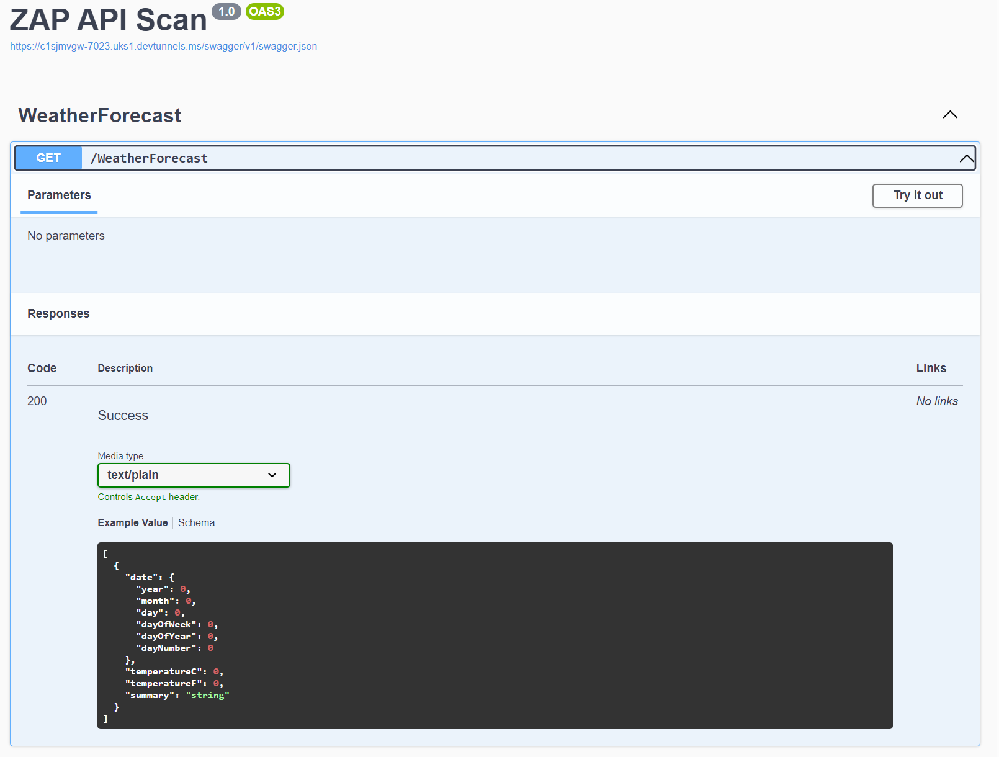
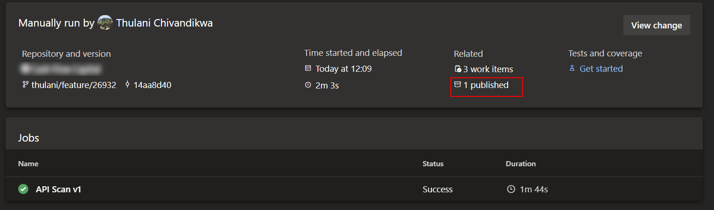
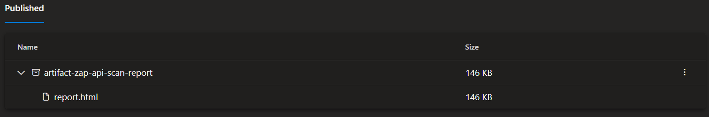
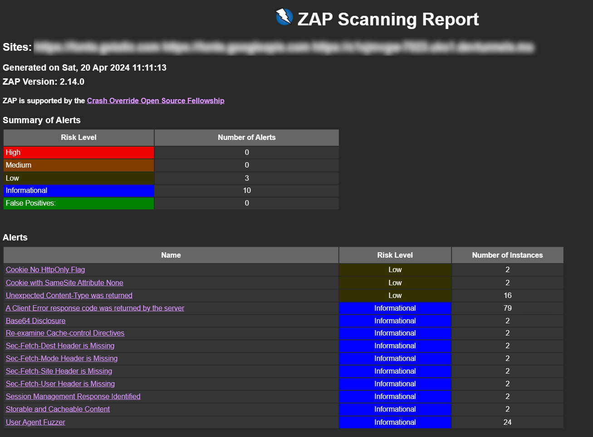
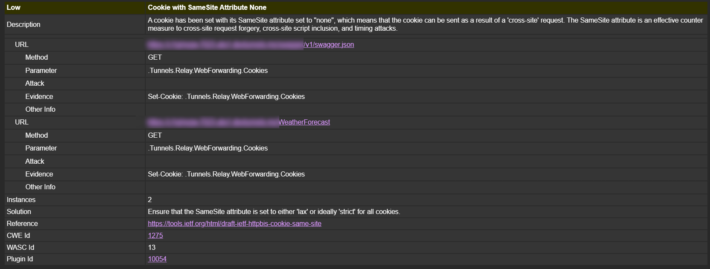

Photo by <a href="https://unsplash.com/@scottwebb?utm_content=creditCopyText&utm_medium=referral&utm_source=unsplash">Scott Webb</a> on <a href="https://unsplash.com/photos/two-bullet-surveillance-cameras-attached-on-wall-yekGLpc3vro?utm_content=creditCopyText&utm_medium=referral&utm_source=unsplash">Unsplash</a>


# OWASP ZAP API scan automation with Azure Pipelines

[[_TOC_]]


[OWASP ZAP](https://www.zaproxy.org/getting-started/)) is a free, feature-filled web app scanner. Being under the OWASP banner, you can be sure that it is backed by a lot of industry experts and security best practices. This tool is particularly great for those who are new to security testing and have limited knowledge and skills, but would still like to ensure that their web apps are secure.

You can make use of the desktop application, which is available for download [here](https://www.zaproxy.org/)). This article however goes over how to automate API scans using the docker images shipped by ZAP. Docker is the easiest way to get started with ZAP automation and offers a lot of flexibility, there are however [other ways to automate ZAP](https://www.zaproxy.org/docs/automate/)).

## Short intro to ZAP

At its core, ZAP is what is known as a `man-in-the-middle proxy.` It stands between the tester’s browser and the web application so that it can intercept and inspect messages sent between the browser and web application, modify the contents if needed, and then forward those packets to the destination. It can be used as a stand-alone application and as a daemon process.


ZAP ships out multiple docker images that can be used for scanning web apps, of interest `ghcr.io/zaproxy/zaproxy:stable` which is used in this article.

All of the docker images (apart from the ‘bare’ one) provide a set of packaged scan scripts:

- [Baseline Scan](https://www.zaproxy.org/docs/docker/baseline-scan/) which runs the ZAP spider against the target for (by default) 1 minute followed by an optional ajax spider scan before reporting the results of the passive scanning.
- [Full Scan](https://www.zaproxy.org/docs/docker/full-scan/) which runs the ZAP spider against the target (by default with no time limit) followed by an optional Ajax spider scan and then a full active scan before reporting the results.
- [API Scan](https://www.zaproxy.org/docs/docker/api-scan/) which performs an active scan against APIs defined by OpenAPI, or GraphQL (post 2.9.0) via either a local file or a URL. - This is the one we shall be working with

## ZAP API scan

The ZAP API scan is a script that is available in the ZAP [Docker](https://www.zaproxy.org/docs/docker/about/) images. It is tuned for performing scans against APIs defined by OpenAPI, SOAP, or GraphQL via either a local file or a URL. It imports the definition that you specify and then runs an Active Scan against the URLs found. The Active Scan is tuned to APIs, so it doesn’t bother looking for things like XSSs.

It also includes 2 scripts:

- Raise alerts for any HTTP Server Error response codes
- Raise alerts for any URLs that return content types that are not usually associated with APIs

For our example, we are going to run the container with this configuration

<details>
<summary>🖱️ Click to expand</summary>

```bash
# Run a Docker container using the specified image
docker run \
# Mount the current directory to /zap/wrk/ in the container with read/write access
-v $(pwd):/zap/wrk/:rw \
# Allocate the container
-t ghcr.io/zaproxy/zaproxy:stable zap-api-scan.py \
# Target URL for the API scan, dynamically specifies the JSON file from Swagger
-t '$(ZapApiTarget)/$(apiSuffix)/swagger.json' \
# Specify HTML report file name
-r report.html \
# Output in JSON format
-j \
# Ignore minor warnings
-I \
# Set the alert threshold level (minimum level to consider)
-l INFO \
# Run all active scans
-a \
# Use specified config file for the scan
-c api-scan.conf \
# Use specified context file
-n api.context \
# Set the input format as OpenAPI
-f openapi \
# Set default level for additional rules
-i WARN
```
</details>

This will start the container to target a site URL we provide outputting an HTML report of the scan results.

The configuration file provides the rules that should be used in the scan and the desired response. A default configuration file can be created using the ‘-g’ parameter

We will make use of the following configuration

<details>
<summary>🖱️ Click to expand</summary>

```bash
# zap-api-scan rule configuration file
# Change WARN to IGNORE to ignore rule or FAIL to fail if rule matches
# Active scan rules set to IGNORE will not be run which will speed up the scan
# Only the rule identifiers are used - the names are just for info
# You can add your own messages to each rule by appending them after a tab on each line.
0	WARN	(Directory Browsing - Active/release)
10003	WARN	(Vulnerable JS Library - Passive/release)
10009	WARN	(In Page Banner Information Leak - Passive/alpha)
10010	WARN	(Cookie No HttpOnly Flag - Passive/release)
10011	WARN	(Cookie Without Secure Flag - Passive/release)
10012	WARN	(Password Autocomplete in Browser - Passive/release)
10015	WARN	(Re-examine Cache-control Directives - Passive/release)
10017	WARN	(Cross-Domain JavaScript Source File Inclusion - Passive/release)
10019	WARN	(Content-Type Header Missing - Passive/release)
10020	WARN	(Anti-clickjacking Header - Passive/release)
10021	WARN	(X-Content-Type-Options Header Missing - Passive/release)
10023	WARN	(Information Disclosure - Debug Error Messages - Passive/release)
10024	WARN	(Information Disclosure - Sensitive Information in URL - Passive/release)
10025	WARN	(Information Disclosure - Sensitive Information in HTTP Referrer Header - Passive/release)
10026	WARN	(HTTP Parameter Override - Passive/beta)
10027	WARN	(Information Disclosure - Suspicious Comments - Passive/release)
10028	WARN	(Open Redirect - Passive/beta)
10029	WARN	(Cookie Poisoning - Passive/beta)
10030	WARN	(User Controllable Charset - Passive/beta)
10031	WARN	(User Controllable HTML Element Attribute (Potential XSS) - Passive/beta)
10032	WARN	(Viewstate - Passive/release)
10033	WARN	(Directory Browsing - Passive/beta)
10034	WARN	(Heartbleed OpenSSL Vulnerability (Indicative) - Passive/beta)
10035	WARN	(Strict-Transport-Security Header - Passive/beta)
10036	WARN	(HTTP Server Response Header - Passive/beta)
10037	WARN	(Server Leaks Information via "X-Powered-By" HTTP Response Header Field(s) - Passive/release)
10038	WARN	(Content Security Policy (CSP) Header Not Set - Passive/release)
10039	WARN	(X-Backend-Server Header Information Leak - Passive/beta)
10040	WARN	(Secure Pages Include Mixed Content - Passive/release)
10041	WARN	(HTTP to HTTPS Insecure Transition in Form Post - Passive/beta)
10042	WARN	(HTTPS to HTTP Insecure Transition in Form Post - Passive/beta)
10043	WARN	(User Controllable JavaScript Event (XSS) - Passive/beta)
10044	WARN	(Big Redirect Detected (Potential Sensitive Information Leak) - Passive/beta)
10045	WARN	(Source Code Disclosure - /WEB-INF folder - Active/release)
10048	WARN	(Remote Code Execution - Shell Shock - Active/beta)
10049	WARN	(Content Cacheability - Passive/alpha)
10050	WARN	(Retrieved from Cache - Passive/beta)
10052	WARN	(X-ChromeLogger-Data (XCOLD) Header Information Leak - Passive/beta)
10054	WARN	(Cookie without SameSite Attribute - Passive/release)
10055	WARN	(CSP - Passive/release)
10056	WARN	(X-Debug-Token Information Leak - Passive/release)
10057	WARN	(Username Hash Found - Passive/release)
10061	WARN	(X-AspNet-Version Response Header - Passive/release)
10062	WARN	(PII Disclosure - Passive/beta)
10063	WARN	(Permissions Policy Header Not Set - Passive/alpha)
10094	WARN	(Base64 Disclosure - Passive/alpha)
10095	WARN	(Backup File Disclosure - Active/beta)
10096	WARN	(Timestamp Disclosure - Passive/release)
10097	WARN	(Hash Disclosure - Passive/beta)
10098	WARN	(Cross-Domain Misconfiguration - Passive/release)
10099	WARN	(Source Code Disclosure - Passive/alpha)
10105	WARN	(Weak Authentication Method - Passive/release)
10108	WARN	(Reverse Tabnabbing - Passive/beta)
10109	WARN	(Modern Web Application - Passive/beta)
10110	WARN	(Dangerous JS Functions - Passive/alpha)
10202	WARN	(Absence of Anti-CSRF Tokens - Passive/release)
2	WARN	(Private IP Disclosure - Passive/release)
20012	WARN	(Anti CSRF Tokens Scanner - Active/beta)
20014	WARN	(HTTP Parameter Pollution scanner - Active/beta)
20015	WARN	(Heartbleed OpenSSL Vulnerability - Active/beta)
20016	WARN	(Cross-Domain Misconfiguration - Active/beta)
20017	WARN	(Source Code Disclosure - CVE-2012-1823 - Active/beta)
20018	WARN	(Remote Code Execution - CVE-2012-1823 - Active/beta)
20019	WARN	(External Redirect - Active/release)
3	WARN	(Session ID in URL Rewrite - Passive/release)
30001	WARN	(Buffer Overflow - Active/release)
30002	WARN	(Format String Error - Active/release)
30003	WARN	(Integer Overflow Error - Active/beta)
40003	WARN	(CRLF Injection - Active/release)
40008	WARN	(Parameter Tampering - Active/release)
40009	WARN	(Server Side Include - Active/release)
40012	WARN	(Cross Site Scripting (Reflected) - Active/release)
40013	WARN	(Session Fixation - Active/beta)
40014	WARN	(Cross Site Scripting (Persistent) - Active/release)
40016	WARN	(Cross Site Scripting (Persistent) - Prime - Active/release)
40017	WARN	(Cross Site Scripting (Persistent) - Spider - Active/release)
40018	WARN	(SQL Injection - Active/release)
40019	WARN	(SQL Injection - MySQL - Active/beta)
40020	WARN	(SQL Injection - Hypersonic SQL - Active/beta)
40021	WARN	(SQL Injection - Oracle - Active/beta)
40022	WARN	(SQL Injection - PostgreSQL - Active/beta)
40023	WARN	(Possible Username Enumeration - Active/beta)
40026	WARN	(Cross Site Scripting (DOM Based) - Active/beta)
40028	WARN	(ELMAH Information Leak - Active/release)
40032	WARN	(.htaccess Information Leak - Active/release)
42	WARN	(Source Code Disclosure - SVN - Active/beta)
50000	WARN	(Script Active Scan Rules - Active/release)
50001	WARN	(Script Passive Scan Rules - Passive/release)
6	WARN	(Path Traversal - Active/release)
7	WARN	(Remote File Inclusion - Active/release)
90001	WARN	(Insecure JSF ViewState - Passive/release)
90002	WARN	(Java Serialization Object - Passive/alpha)
90003	WARN	(Sub Resource Integrity Attribute Missing - Passive/alpha)
90004	WARN	(Insufficient Site Isolation Against Spectre Vulnerability - Passive/alpha)
90011	WARN	(Charset Mismatch - Passive/release)
90019	WARN	(Server Side Code Injection - Active/release)
90020	WARN	(Remote OS Command Injection - Active/release)
90022	WARN	(Application Error Disclosure - Passive/release)
90026	WARN	(SOAP Action Spoofing - Active/alpha)
90028	WARN	(Insecure HTTP Method - Active/beta)
90029	WARN	(SOAP XML Injection - Active/alpha)
90030	WARN	(WSDL File Detection - Passive/alpha)
90033	WARN	(Loosely Scoped Cookie - Passive/release)
```
</details>

The context file provides an additional configuration that indicates what URLs should be scanned and additional scan configuration. Consult the desktop documentation for instructions on how to save the context from a configuration done with the application.

We shall be using the following context file

<details>
<summary>🖱️ Click to expand</summary>

```xml
<?xml version="1.0" encoding="UTF-8" standalone="no"?>
<configuration>
    <context>
        <name>Test API</name>
        <desc/>
        <inscope>true</inscope>
        <incregexes>https://c1sjmvgw-7023.uks1.devtunnels.ms/.*</incregexes>
        <tech>
            <include>Db</include>
            <include>Db.CouchDB</include>
            <include>Db.Firebird</include>
            <include>Db.HypersonicSQL</include>
            <include>Db.IBM DB2</include>
            <include>Db.Microsoft Access</include>
            <include>Db.Microsoft SQL Server</include>
            <include>Db.MongoDB</include>
            <include>Db.MySQL</include>
            <include>Db.Oracle</include>
            <include>Db.PostgreSQL</include>
            <include>Db.SAP MaxDB</include>
            <include>Db.SQLite</include>
            <include>Db.Sybase</include>
            <include>Language</include>
            <include>Language.ASP</include>
            <include>Language.C</include>
            <include>Language.JSP/Servlet</include>
            <include>Language.Java</include>
            <include>Language.Java.Spring</include>
            <include>Language.JavaScript</include>
            <include>Language.PHP</include>
            <include>Language.Python</include>
            <include>Language.Ruby</include>
            <include>Language.XML</include>
            <include>OS</include>
            <include>OS.Linux</include>
            <include>OS.MacOS</include>
            <include>OS.Windows</include>
            <include>SCM</include>
            <include>SCM.Git</include>
            <include>SCM.SVN</include>
            <include>WS</include>
            <include>WS.Apache</include>
            <include>WS.IIS</include>
            <include>WS.Tomcat</include>
        </tech>
        <urlparser>
            <class>org.zaproxy.zap.model.StandardParameterParser</class>
            <config>{"kvps":"&amp;","kvs":"=","struct":[]}</config>
        </urlparser>
        <postparser>
            <class>org.zaproxy.zap.model.StandardParameterParser</class>
            <config>{"kvps":"&amp;","kvs":"=","struct":[]}</config>
        </postparser>
        <authentication>
            <type>0</type>
            <strategy>EACH_RESP</strategy>
            <pollfreq>60</pollfreq>
            <pollunits>REQUESTS</pollunits>
        </authentication>
        <forceduser>-1</forceduser>
        <session>
            <type>0</type>
        </session>
        <authorization>
            <type>0</type>
            <basic>
                <header/>
                <body/>
                <logic>AND</logic>
                <code>-1</code>
            </basic>
        </authorization>
    </context>
</configuration>

```
</details>

For the actual scan we will be running we shall simply create a new ASP.NET Core Web API using the default Visual Studio template and tunnel this over the public internet from a development machine so our demonstration Azure Pipeline can access it without the need to deploy somewhere. The scan can be done against an OpenAPI, SOAP or GraphQL spec, in our case the Web API emits a Swagger OpenAPI spec that we will point to.




The most important being the incregexes which indicates the URL https://c1sjmvgw-7023.uks1.devtunnels.ms/.* This URL will be what we will tunnel our sample API via for scanning over the public internet.

> ⚠️ This is for demonstration purposes and to eventually allow Azure Pipelines to access an API that is on a local development machine.

On running this we will be able to see any scan issues in the console. For example, we may see something like this

```bash
WARN-NEW: Cookie No HttpOnly Flag [10010] x 2
	https://c1sjmvgw-7023.uks1.devtunnels.ms/WeatherForecast (200 OK)
	***/v1/swagger.json (200 OK)
```

You can find full usage instructions [here](https://www.zaproxy.org/docs/docker/api-scan/)).

## Azure Pipelines

We can then proceed to use the same approach we have seen above, in an Azure Pipeline.

<details>
<summary>🖱️ Click to expand</summary>

```yml
name: $(Year:yyyy).$(Month)$(rev:.r)-owasp-zap

trigger:
  - none

parameters:
  - name: defaultLevelForAdditionalRules
    displayName: Default rules not in the config file to
    type: string
    default: WARN
    values:
      - PASS
      - IGNORE
      - INFO
      - WARN
      - FAIL
  - name: minimumLevel
    displayName: Minimum level to show in report
    type: string
    default: INFO
    values:
      - PASS
      - IGNORE
      - INFO
      - WARN
      - FAIL
variables:
  - group: [Group Name]
  - name: project
    value: "[Project Name]"

# decide on a schedule or trigger for the scan
# schedules:
#     - cron: "0 0 1 * *"
#       displayName: First day of each month midnight
#       branches:
#           include:
#               - master

stages:
  - stage: apiScan
    displayName: Run OWASP ZAP - API Scan
    jobs:
      - job: apiScanJob
        strategy:
          matrix:
            v1:
              apiSuffix: "v1"
            # v2:
            #   apiSuffix: 'v2'
        displayName: API Scan
        steps:
          - task: CopyFiles@2
            inputs:
              SourceFolder: "zap-config"
              Contents: "**"
              TargetFolder: "./"
              OverWrite: true


          - bash: |
              chmod -R 777 ./
              docker run \
              -v $(pwd):/zap/wrk/:rw \
              -t ghcr.io/zaproxy/zaproxy:stable zap-api-scan.py \
              -t '$(ZapApiTarget)/$(apiSuffix)/swagger.json' \
              -r report.html \
              -j \
              -I \
              -l ${{parameters.minimumLevel}} \
              -a \
              -c api-scan.conf \
              -n api.context \
              -f openapi \
              -i ${{parameters.defaultLevelForAdditionalRules}}
            displayName: Trigger docker scan
              # when working with API keys
              # -e ZAP_AUTH_HEADER_VALUE='$(ZAP_AUTH_HEADER_VALUE)' \
              # -e ZAP_AUTH_HEADER='$(ZAP_AUTH_HEADER)' \

          - task: PublishPipelineArtifact@1
            displayName: Publish Report
            condition: succeeded()
            inputs:
              targetPath: 'report.html'
              artifactName: 'artifact-zap-api-scan-report'

          - task: Bash@3
            inputs:
              targetType: "inline"
              script: |
                cat report.html | tr -d '\n' | jq --arg to "$(ZapRunRecipients)" \
                                                    --arg from "$(ZapSenderEmail)" \
                                                    --slurp --raw-input \
                                                    '{
                  personalizations: [
                    {
                      to: [
                        {
                          email: $to
                        }
                      ]
                    }
                  ],
                  from: {
                    email: $from
                  },
                  subject: "OWASP ZAP - API Scan Report",
                  content: [
                    {
                      type: "text/html",
                      value: .
                    }
                  ]
                }' > payload.json

                curl --request POST \
                  --url https://api.sendgrid.com/v3/mail/send \
                  --header 'Authorization: Bearer $(SendGridApiKey)' \
                  --header 'Content-Type: application/json' \
                  --data-binary "@payload.json"

```
</details>


This pipeline makes use of Send Grid via curl to send the report as an email. You can edit this step to your requirements. The report file is also available as a published artefact after the pipeline run.









## Conclusion

This article barely scratches the surface on what you can do with OWASP ZAP. A good starting point would be to play with the desktop application and go through the documentation to see what ZAP can do and automate that. It will mostly be about exporting your configuration so you can consume it in the docker containers.

This article specifically covered API scanning, but you can use it to scan any web app, including running aggressive attacks to see how resilient the penetration measures are.

> 🛑**Think twice** before considering running OWASP ZAP on an application in a production environment as you can cause real damage.

> 🛑 **NEVER** run OWASP ZAP against a site that you do not own without authorization as that can constitute hacking and is unethical.

✅ **DO** keep the ethos of Playwright in mind. The tool is simple and does two things and two things well, perform actions and assert state against expectations. Unlike a lot of other traditional tools, having to wait for things prior to actions or asserts **is not a thing** and when done is usually a smell of something else being wrong.

> These design choices allow Playwright users to forget about flaky timeouts and racy checks in their tests altogether.

✅ **DO** familiarize yourself with useful commands

```bash
# run all tests headless
npx playwright test

# run all tests in debug mode
npx playwright test --debug

# run all tests with parallelization disabled
npx playwright test --workers=1

# run tests with fail-fast
npx playwright test --max-failures=10

# run all tests with tracing on
# this should always be used on CI runs
npx playwright test --trace on

# run a specific test by file name
npx playwright test [test-file-name].ts

# run a specific test by test title
npx playwright test -g [target title]

# run tests that contain certain string in the file name
npx playwright test [target-string] # target strings can be chained

# run specific tests by  directory
npx playwright test test/[directory-name] # directories can be chanined

# run all tests in headed mode
npx playwright test --headed

# run all tests in a specific browser
npx playwright test --project webkit # --project can be chained

# view last run test report
npx playwright show-report

# run all test with the UI
npx playwright test --ui

# run the code gen to generate tests off a browser interaction
npx playwright codegen [optional-url]

# get help 🆘
npx playwright test --help
```

✅ **DO** familiarize yourself with the Playwright [tracing and trace viewer.](https://playwright.dev/docs/trace-viewer-intro)

✅ **DO** familiarize yourself with the various test [annotations](https://playwright.dev/docs/test-annotations)

✅ **DO** consider targeting the [latest LTS node version](https://nodejs.org/en/download) at the point of creating a new Playwright project. This ensures that you start of with the latest guaranteed support with the widest compatibility and stability.

> Consider using [NVM](https://github.com/nvm-sh/nvm) or an alternative, to manage your node versions especially if you are likely to work on multiple things that may end up having different node version requirements.

✅ **DO** make use of the [official Playwright VS Code extension](https://marketplace.visualstudio.com/items?itemName=ms-playwright.playwright) for an improved experience.

> The VS Code test runner runs your tests on the default browser of Chrome. To run on other/multiple browsers click the play button's dropdown and choose another profile or modify the default profile by clicking `Select Default Profile` and select the browsers you wish to run your tests on.

✅ **DO** keep your playwright and related dependencies up to date. By updating regularly you keep up with the new features, continued improvements in browser support, bug fixes, compatibility with new features etc. Incrementally updating tends to be much easier than a big bang when you finally need a specific version, especially when dealing with breaking changes.

```bash
npm install -D @playwright/test@latest

# Also download new browser binaries and their dependencies:
npx playwright install --with-deps

# check the version
npx playwright --version
```

> Consider [npm-outdated](https://docs.npmjs.com/cli/v10/commands/npm-outdated/) as a tool to manage your dependencies.

> Consider using the [Version Lens extension in VS Code](https://marketplace.visualstudio.com/items?itemName=pflannery.vscode-versionlens) to check for outdated packages and update them on the click of a button.

✅ **DO** make use of the page object model approach to separate the management of a single page's logic into one source of truth for a clean code structure that encourages the single responsibility making the maintenance of a large test suite over time easier.

This generally makes your tests easier to read at the top level, example:

```typescript
test('given valid details, creating a new credit application from scratch should succeed', async ({
  page,
}) => {
  const businessDetailsPage = new BusinessDetailsPage(page);
  const businessVerificationPage = new BusinessVerificationPage(page);
  const documentsPage = new DocumentsPage(page);

  const businessDetails = new BusinessDetailsBuilder().thatIsValid().build();

  const businessVerification = new BusinessVerificationBuilder().thatIsValid().build();

  const documents = new DocumentsBuilder().thatIsValid().build();

  // submit business details
  await businessDetailsPage.goto();
  await businessDetailsPage.assertInitialState();
  await businessDetailsPage.fill(businessDetails);
  await businessDetailsPage.submit();

  // submit business verification details
  await businessVerificationPage.assertInitialState();
  await businessVerificationPage.fill(businessVerification);
  await businessVerificationPage.submitManualUpload();

  // upload documents
  await documentsPage.assertInitialState();
  await documentsPage.fill(documents);
  await documentsPage.submit();
});
```

A page object model class is generally just a class that accepts a page (or more) and encapsulates any logic about that page like locators, assertions, actions etc. Here is a sample skeleton

```typescript
export class SamplePage {
  public readonly page: Page;
  public readonly doneButton: Locator;

  public constructor(page: Page) {
    this.page = page;
    this.doneButton = this.page.getByRole('button', { name: 'Done' });
  }

  public async assertInitialState() {}

  public async goto() {
    await this.page.goto('/');
  }

  public async submit() {
    await this.doneButton.click();
  }
}
```

✅ **DO** adopt fakers for creating random yet realistic test data. For TypeScript tests, the library [Faker JS](https://fakerjs.dev/) is an excellent choice for this.

✅ **DO** adopt a builder model to separate the creation of test data from everything as with one source of truth that allows for a test suite to remain maintainable. Sample:

```typescript
export class LandLordBuilder extends Builder<LandLord> {
  constructor() {
    super(LandLord);
  }

  public override thatIsValid(): this {
    this.with((x) => x.fullName, faker.person.fullName());
    this.with((x) => x.cellphoneNumber, `0${faker.string.numeric(9)}`);
    this.with((x) => x.emailAddress, faker.internet.email());
    this.with((x) => x.leaseStartDate, faker.date.past());
    this.with((x) => x.leaseEndDate, faker.date.future());
    return this;
  }
}

# Example usage
const landlord = new LandLordBuilder()
  .thatIsValid()
  .build();
```

This example relies on the following base implementation.

```typescript
export interface BuilderBase<T> {
  with<TProp>(propertyExpr: (obj: T) => TProp, value: TProp): this;

  withBuilder<TProp, TBuilder extends BuilderBase<unknown>>(
    propertyExpr: (obj: T) => TProp,
    value: TBuilder,
  ): this;

  withMany<TProp, TBuilder extends BuilderBase<unknown>>(
    propertyExpr: (obj: T) => TProp[],
    values: TBuilder[],
  ): this;

  ignoreProperty<TProp>(propertyExpr: (obj: T) => TProp): this;

  thatIsValid(): this;

  build(): T;
}

export abstract class Builder<T> implements BuilderBase<T> {
  private _properties: { [key: string]: unknown } = {};

  public constructor(private readonly typeConstructor: new () => T) {}

  public with<TProp>(propertyExpr: (obj: T) => TProp, value: TProp): this {
    const propertyName = this.extractPropertyName(propertyExpr);
    this._properties[propertyName] = value;
    return this;
  }

  public withBuilder<TProp, TBuilder extends BuilderBase<unknown>>(
    propertyExpr: (obj: T) => TProp,
    value: TBuilder,
  ): this {
    const propertyName = this.extractPropertyName(propertyExpr);
    this._properties[propertyName] = value.build();
    return this;
  }

  public withMany<TProp, TBuilder extends BuilderBase<unknown>>(
    propertyExpr: (obj: T) => TProp[],
    values: TBuilder[],
  ): this {
    const propertyName = this.extractPropertyName(propertyExpr);
    this._properties[propertyName] = values.map(v => v.build());
    return this;
  }

  public abstract thatIsValid(): this;

  public ignoreProperty<TProp>(propertyExpr: (obj: T) => TProp): this {
    const propertyName = this.extractPropertyName(propertyExpr);
    delete this._properties[propertyName];
    return this;
  }

  public build(): T {
    const instance = this.createInstance();

    for (const key in this._properties) {
      instance[key] = this._properties[key];
    }

    return instance;
  }

  protected createInstance(): T {
    return new this.typeConstructor();
  }

  private extractPropertyName<TProp>(expr: (obj: T) => TProp): string {
    const parts = expr.toString().match(/\.([^.]+)/);
    if (!parts) {
      throw new Error("Couldn't extract property name.");
    }
    return parts[1];
  }
}

export class DynamicBuilder<T> extends Builder<T> {
  public constructor(private readonly typeCtor: new () => T) {
    super(typeCtor);
  }

  public thatIsValid(): this {
    throw new Error('Method not implemented.');
  }
}
```

✅ **DO**  consider configuring a base URL for your tests so this can be defined in one place and reused across your tests.

```typescript
export default defineConfig({
  use: {
    baseURL: 'http://127.0.0.1:3000',
  },
});
```

✅ **DO**  consider reading any application configuration, regardless of source (environment variables, key vault secrets etc), in a central run once fixture.

Example. This will pull values from a .env file using [dotenv](https://www.npmjs.com/package/dotenv) and pull user secrets from an [Azure Key Vault](https://azure.microsoft.com/en-gb/products/key-vault) using a getSecret utility method.

```typescript
import { test as base } from '@playwright/test';
import dotenv from 'dotenv';
import { env } from 'process';

import { getSecret } from '../helpers/secrets';

type ConfigurationFixture = {
  configuration: Configuration;
};

export const test = base.extend<ConfigurationFixture>({
  configuration: async ({}, use) => {
    dotenv.config();

    const secrets: Configuration = {
      userPassword: await getSecret('user-password'),
      imitateEmailAuth: await getSecret('websocket-auth'),
      userEmail: env.UserEmail as string,
    };
    await use(secrets);
  },
});
```

getSecret utility

```typescript
import { DefaultAzureCredential } from '@azure/identity';
import { SecretClient } from '@azure/keyvault-secrets';

const credential = new DefaultAzureCredential();
const vaultName = '[vault name]';
const url = `https://${vaultName}.vault.azure.net`;
const client = new SecretClient(url, credential);

/**
 * Retrieves a secret from Azure Key Vault based on the given secret name.
 * @param name The name of the secret to retrieve.
 * @returns The value of the secret as a string.
 * @throws Will throw an error if unable to retrieve the secret.
 */
export const getSecret = async (name: string) => {
  try {
    const secret = await client.getSecret(name);
    return secret.value as string;
  } catch (error) {
    console.error(error);
    throw error;
  }
};
```

✅ **DO** write tests that assert the visible behaviour of your application and not on the inner workings. This will make your tests more resilient to changes in the underlying implementation. Examples of good things to check

- Elements on the page and their state i.e. what is visible, what is enabled etc.
- The URL of the page
- The title of the page
- A screenshot of the page

Examples of things that may be less resilient to changes

- The exact structure of the DOM
- The CSS classes used on elements

✅ **DO** critically think through and configure the desired browsers and devices to run your tests on. This will ensure that your tests are running on the platforms that are most important to you and will help you catch issues early.

```typescript
export default defineConfig({
  projects: [
    {
      name: 'chromium',
      use: { ...devices['Desktop Chrome'] },
    },
    {
      name: 'firefox',
      use: { ...devices['Desktop Firefox'] },
    },
    {
      name: 'webkit',
      use: { ...devices['Desktop Safari'] },
    } /* Test against mobile viewports. */,
    {
      name: 'Mobile Chrome',
      use: { ...devices['Pixel 5'] },
    },
    {
      name: 'Mobile Safari',
      use: { ...devices['iPhone 12'] },
    } /* Test against branded browsers. */,
    {
      name: 'Microsoft Edge',
      use: { ...devices['Desktop Edge'], channel: 'msedge' },
    },
    {
      name: 'Google Chrome',
      use: { ...devices['Desktop Chrome'], channel: 'chrome' },
    },
  ],
});
```

✅ **DO** fast track your process by leveraging the [Playwright test generator](https://playwright.dev/docs/codegen-intro) to create tests for you. This will give you a good starting point and you can then modify the tests to suit your needs.

```bash
npx playwright codegen [optional-url]
```

> You can also generate tests using [emulation](https://playwright.dev/docs/test-use-options) to generate a test for a specific viewport, device, color scheme, as well as emulate the geolocation, language or timezone.

✅ **DO** enable retries on CI to make your tests more resilient to flakiness.

✅ **DO** enable tracing to help diagnose failing tests in CI.

> Traces and debugging can also be leveraged locally to diagnose issues with your tests.

✅ **DO** make use of test hooks (`test.describe`, `test.beforeEach`, `test.afterEach`, `test.beforeAll`, `test.afterAll`) for grouping and granular tests to make sure each test is specific and focused. This will make it easier to diagnose failures and will make your tests more resilient to changes in the application.

✅ **DO** keep up with the [Playwright release notes]([Release notes | Playwright](https://playwright.dev/docs/release-notes)) as a nice way to see what new APIs are being released.

✅ **DO** setup linting for your playwright tests with the [ESLint plugin for Playwright.]([eslint-plugin-playwright - npm (npmjs.com)](https://www.npmjs.com/package/eslint-plugin-playwright)). Enable caching with your linting for faster subsequent runs.

```bash
npm init @eslint/config@latest
```

Sample .eslintrc.json config

```json
{
  "parser": "@typescript-eslint/parser",
  "parserOptions": {
    "ecmaVersion": 12,
    "sourceType": "module"
  },
  "plugins": ["@typescript-eslint"],
  "extends": [
    "eslint:recommended",
    "plugin:@typescript-eslint/recommended",
    "plugin:playwright/recommended"
  ],
  "rules": {},
  "env": {
    "browser": true,
    "es2021": true
  }
}
```

```json
# in package.json
  "scripts": {
    "lint": "eslint \"**/*.ts\" --cache"
  },
  "lint-staged": {
    "*.ts": "eslint --cache"
  }
```

✅ **DO** consider [lint staged](https://github.com/lint-staged/lint-staged) as a way to be able to run linting only for the files that you have just changed. `npm install -D lint-staged`

```json
# in package.json
  "lint-staged": {
    "*.ts": "eslint --cache"
  }
```

⚠️ **DO** give close attention to the need for any waits or sleeps in your tests. This is a common source of flakiness and should in most cases not be necessary given how Playwright is designed to work.

> Playwright assertions are designed in a way that they describe the expectations that need to be eventually met.

> Playwright automatically waits for the wide range of actionability checks to pass before performing each action.

✅ **DO** make use of an .env file to have a single source of truth for environment values. You can conveniently load env files globally by adding this into your `playwright.config.ts`

```typescript
import { defineConfig, devices } from '@playwright/test';
import dotenv from 'dotenv';

// Read from default ".env" file.
dotenv.config();
```

✅ **DO** write custom assertions to simplify assertions you use in combination or common things you assert that require custom logic.

```typescript
import type { Locator } from '@playwright/test';
import { expect as baseExpect } from '@playwright/test';

export const expect = baseExpect.extend({
    async toBeVisibleAndEmpty(locator: Locator) {
        const assertionName = 'toBeVisibleAndEmpty';
        const isVisible = await locator.isVisible();
        if (!isVisible) {
            return {
                message: () => `expected locator to be visible`,
                pass: false,
            };
        }

        const content = await locator.textContent();
        const isEmpty = content?.trim() === '';
        if (!isEmpty) {
            return {
                message: () => `expected locator to be empty, but got "${content}"`,
                pass: false,
            };
        }

        return {
            message: () => `locator is visible and empty`,
            pass: true,
            name: assertionName
        };
    },
...
});

```

🛑 **DO** not hard code secrets in tests or any artifact that will be committed to your repository. Consider making use of an Azure Key Vault instead.

Sample helper

You will need to install the following package

```bash
npm install -D @azure/keyvault-secrets
npm install -D @azure/identity
```

You will need to have at minimum the Azure IAM `Key Vaults Secret User` role assigned.

## Automation Plan Checklist

Here is a list of questions you can ask yourself about what you want to automate so you can have a clear plan of action before you start. If you roll with the punches, you will be a slave to so many things that you will have much more control by planning and deciding.

- [ ] What language am I going to target?
- [ ] How am I going to use fixtures?
  - [ ] What scenarios do I need isolation for?
  - [ ] What state do I need to share among multiple tests?
- [ ] What are the most important things to automate? 💡Prioritize critical paths
  - [ ] What are my blockers?
  - [ ] Do I need static data?
    - [ ] Do I need setup scripts?
    - [ ] Can this data always be available?
  - [ ] Do I need cleanup scripts?
  - [ ] Can I group these into common themes that I can run as parameterized tests?
  - [ ] How am I going to structure and name my tests?
  - [ ] What things are required by multiple tests that I can make helpers for?
  - [ ] Do I need to test for accessibility?
- [ ] What browsers do I need to target?
  - [ ] What devices do I need to emulate?
  - [ ] What viewports am I interested in?
  - [ ] Do I need to emulate locales?
  - [ ] Do I need to emulate time zones?
  - [ ] Do I need to emulate system permissions?
  - [ ] Do I need to emulate geolocation?
  - [ ] Do I need to emulate colors schemes and media?
  - [ ] Do I need to emulate being offline?
- [ ] What are the tough challenges I need to solve?
  - [ ] How am I going to handle authentication?
    - [ ] Do I need to share the authentication state among multiple tests?
  - [ ] Do I have to worry about MFA?
  - [ ] Do I have to emulate failing requests?
- [ ] Am I ready to automate runs in CI?
  - [ ] How will I report on failing tests and how can I get more details on that?
  - [ ] Do I have everything working locally consistently?
  - [ ] How many workers can my CI handle?
  - [ ] Do I have exit hatches for my CI to preserve resources?
  - [ ] What type of reports do I want to ship?
  - [ ] Do I want to automate retries on fail?
  - [ ] Do I have linting in place?
  - [ ] Do I have any flaky tests to address?
  - [ ] Do I have to worry about things like VPN requirements?
  - [ ] What is the best time to run the automations? Are there potential interruptions in that window like deployments?
- [ ] Do I have any reason to update the default timeouts? (Expect 5s, Test timeout 30s)
  - [ ] Does this need to be global or per test?
- [ ] Are there any out-of-the-box packages that can simplify my test efforts?
- [ ] Are there scenarios I can make use of visual comparisons?
- [ ] Do I need to save videos of my test runs?
- [ ] How am I going to handle secrets?
- [ ] Have I setup a code review process?
