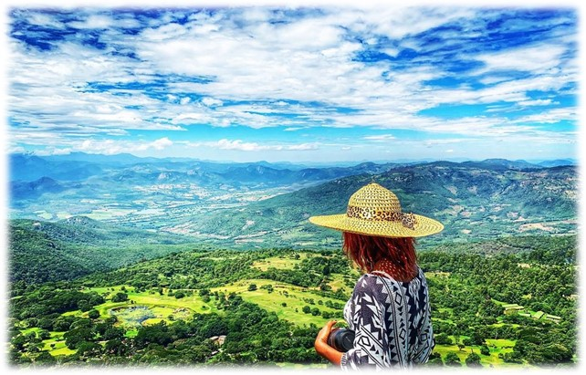
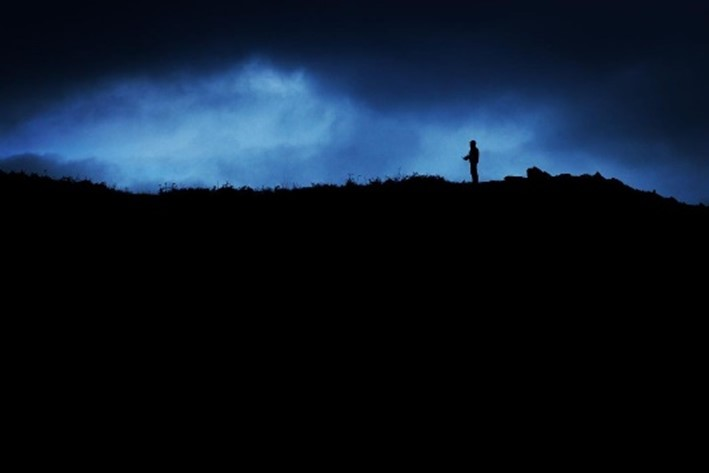
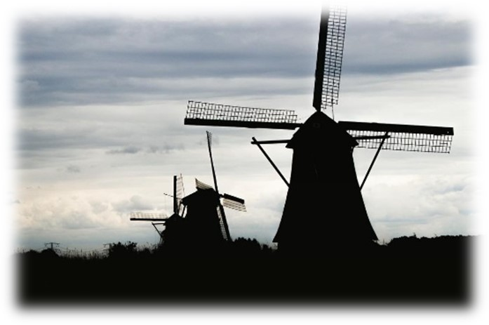
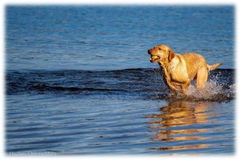
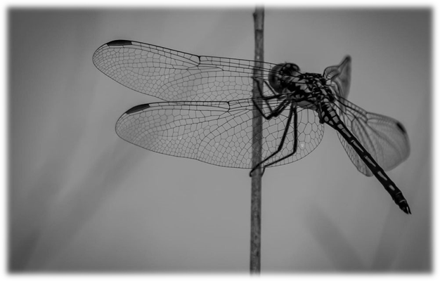

Photo by <a href="https://unsplash.com/@nordwood?utm_content=creditCopyText&utm_medium=referral&utm_source=unsplash">NordWood Themes</a> on <a href="https://unsplash.com/photos/black-and-gray-film-camera-near-printed-photos-F3Dde_9thd8?utm_content=creditCopyText&utm_medium=referral&utm_source=unsplash">Unsplash</a>

# 3 Key life lessons Photography has taught me.

Sometime in 2017, I found myself with plenty of time to spare, bored, tired of routine life and desperately in need of a new hobby. I had always been curious about amateur photography, so I decided to give it a try. I promptly acquired a Canon 1300D (Rebel T6) camera, a popular choice among beginner photographers looking to test the waters without spending a fortune.

Going in, I somewhat expected this to be much like one of the many other things I tried and eventually lost interest in. Fast forward to some 6 years later, my passion for photography is stronger than ever, and I am further invested in it in many other ways. This pursuit has led my family and me to travel a lot, unashamedly, often motivated by my desire to capture the next great shot.

My journey through photography has taken me to extraordinary places, some unusual, others scary. It's been an adventure filled with highs and lows, including navigating a slump during the COVID lockdowns and adjusting to a shift from urban to rural life. But along the way, I've acquired lessons that extend far beyond the scope of photography, profoundly influencing my approach to life.

# Lesson 1 – Balance being in the moment and living the moment.

In the early days of photography journey, I was focused on capturing every moment. This often led me to experience life through the lens, detached from the reality around me. While this wasn't a problem on solo adventures, it became noticeable when traveling with loved ones, especially abroad. I realized that in my quest to capture the perfect moment, I was missing out on creating meaningful memories, and sometimes, even diminishing the experience for others. Decisions like the accumulation of bulky gear didn't just slow me down; it also impacted those around me.

I learned the hard way that being present is as important as capturing the moment. This insight applies not just to photography but to life and career. It's easy to get absorbed in a single task or project, missing out on life's little joys. Productivity is important, but so is enjoying the journey. Our careers and lives should be more than just a collection of achievements; they should be filled with learning, growth, connections, and personal discoveries.

It's easy to become trapped in a single moment. We might get absorbed in a demanding project and miss out on other things, like having lunch with colleagues or attending social events. But in the end, we're not truly living in the present. While productivity and work are important, it's equally important to enjoy the journey because there will come a time when what we have missed weighs heavier on us than we anticipated. Perhaps the project was a success, but we realize that the year wasn’t particularly enjoyable, and we did not grow much.
The greatest lesson photography has given to me is the importance of being present. Let's approach our lives and careers with the wisdom of a seasoned photographer. Let's focus on our goals, but also be mindful of the journey. Let's capture the achievements, but also live the experiences.

> On the day of the shot above, I went too far, dragging a ton of gear up a mountain, including the giant lens which you see my wife being burdened with, and worst of all looking at it all through the lens. The experience could have been a whole lot better in so many ways.

# Lesson 2 – Seek for and be open to constructive criticism.

Right from the first shot I took, I was excited to share my photographs with others and hear their feedback, especially once I became comfortable using my gear. However, I often found that others didn't always share my excitement about certain shots. Initially, this was confusing and disheartening, but I gradually understood the critical difference in perspectives. As a photographer, I focused on technicalities, while viewers reacted to the emotions, visual appeal, and stories conveyed. This perspective is significant because award-winning photos are not judged by other photographers, but by the public, many of whom have no detailed knowledge of photography. This realization underlined the importance of diverse perspectives, not just in photography but in life and career.

Recognizing this important difference made me realize the relevance of other perspectives in my career and life. As someone whose work is overly technical, it is easy to focus on and get absorbed in specific metrics and Key Performance Indicators. However, what I deliver is not viewed in that lens. What truly matters is how my technical expertise translates into meaningful outcomes for others, the clients in particular. The feedback from these diverse groups, who may not understand the intricacies of my work but are the ultimate beneficiaries, is crucial. This experience has made me value the opinions of this group as a key pillar to attaining success.

I have also observed the same phenomenon in life. There are many situations we encounter, where our perception is influenced by our specific perspective, potentially leading to many biases. When we open ourselves up to the opinions of others, whether they are family, friends, or even strangers, we can learn something interesting.

I would recommend approaching life in the same way as a seasoned photographer. Be open to criticism, and if anything, seek it out. You will grow as an individual when people honestly review your work, evaluate the situations you are dealing with, or provide feedback on anything in life, for that matter. Any difference in perception is not a setback but a valuable insight.

> Silhouettes as shown in the 1st two shots, are a technique I enjoy a lot and one I will go out of my way to get. I waited in the same position for over an hour to get that first shot. However, the images that often make an impression on others are the ones that evoke some emotions, much like the last one which usually happens in a split moment, are captured hastily, and do not require much technical finesse to get right. While I continue to shoot what I like and enjoy when I am out to get impressions, I know what my audience likes.

# Lesson 3 – Go out of your way on preparation and embrace unpredictability.

The third and final key lesson was particularly tough for me to learn, as I had to learn it the hard way. Throughout my photography journey, there have been many off days that could have been avoided if I had been a little more prepared. Missing out on shots due to uncharged batteries or forgotten tripods and memory cards, or perhaps not checking the weather, has all been frustrating. Then the time came when I was more prepared for what I knew and expected, but it all changed on the day or in the moment of the shot.

It has been a tough lesson, but over time, what I needed to do better clicked. Now, when I have an important shot or when my family and I are travelling, I have a checklist. I know exactly what I need to bring. I don't bring all my gear, but I always refer to the checklist. I will consider the area we're going to, the type of photography I'll be doing, the sunrise and sunset times, the weather, the distances we'll need to travel and more.

This lesson applies to so many aspects of life and career. The preparation, however, is only half the story. With photography, there lies the ability to adapt to the unexpected: a sudden change in weather, or a spontaneous moment. These unpredictable elements often transform a good photographer into a great one. In our professional and life endeavors, we often equate success with planning – setting clear goals, strategizing, and methodically working towards our objectives. While this is the first part of the lesson and a key thing, the unpredictable nature of the world often throws us curveballs and must be acknowledged. Trends shift, new technologies emerge/deprecate, relationships evolve, and unforeseen challenges arise. The ability to adapt, pivot our strategies, and embrace change is what often separates those who are resilient from those who aren't.

As we walk the path of life/careers, let us be like the photographer who sets up their camera with care but is always ready to capture an unplanned, perfect shot. Let's prepare for the future, but also stay open and adaptable to the unforeseen twists and turns of life. Embracing this balance is the key to not just surviving but thriving in the unpredictable journey of life.

> You need to have all the conditions just right as a photographer to take that one great shot. You need the gear, lighting, camera settings and many other variables to be just right that need preparation. When working with a subject like a dragonfly that only gives you a second or so to work with, preparation and adaptability are everything.

My photography journey has taught me more than just these three lessons. Knowing your tools intimately, stepping out of your comfort zone, valuing your unique journey, avoiding dogmatism about tools or methods, sharing knowledge generously, seeking community and support, and above all, having fun are equally important. These principles, derived from photography but are applicable to every facet of life.

Photography has been more than a hobby; it's been a journey of discovery and learning. It's taught me to view life through various lenses, both literally and metaphorically. As I continue to explore the world through my camera, I'm reminded that life, like photography, is about the journey and the experiences, not just the outcomes. These lessons encourage a fulfilling and adaptive approach to life's challenges and opportunities. Let's navigate our paths with the curiosity of a photographer, prepared yet adaptable, ready to capture life's unexpected beauty.
