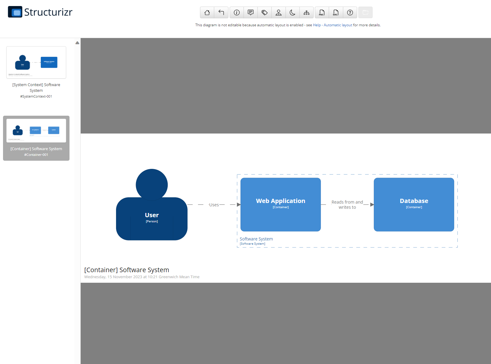

Photo by <a href="https://unsplash.com/@amsterdamcityarchives?utm_content=creditCopyText&utm_medium=referral&utm_source=unsplash">Amsterdam City Archives</a> on <a href="https://unsplash.com/photos/9tmKEDz03uw?utm_content=creditCopyText&utm_medium=referral&utm_source=unsplash">Unsplash</a>

# Structurizr local setup

> This requires an [installation of Docker](https://docs.docker.com/get-docker/) on your local machine.

[Structurizr](https://structurizr.com/) builds upon `diagrams as code`, allowing you to create multiple software architecture diagrams from a single model.

This setup makes use of the [Structurizr DSL](https://docs.structurizr.com/dsl), the recommended option when creating C4 diagrams with Structurizr. Structurizr is specifically designed to support the C4 model for visualising software architecture, by its creator Simon Brown. Diagrams are interactive (e.g. zoom in/out), animatable, embeddable, and include an automatically generated diagram key/legend.

# Local setup

To quickly get up and running run the following docker command

`docker pull structurizr/lite`

This will pull down the docker image and if you start up a container from this it will start with a default diagram. To create your diagrams, however, you would want to point the docker container to a directory locally with the DSL. For example, if the location is `/Users/you/structurizr`, the command would be

`docker run -it --rm -p 8080:8080 -v /Users/you/structurizr:/usr/local/structurizr structurizr/lite
`

Your instance of Structurizr Lite is now running and will be available [locally on port 8080](http://localhost:8080/)

A recommended approach however will be to create your own [docker compose](https://docs.docker.com/compose/) file and in that same directory have a sub directory with your DSL.

Here is a sample docker compose file.

```yml
version: '3.8'

services:
  structurizr:
    container_name: structurizr
    image: structurizr/lite:latest
    ports:
      - '8080:8080'
    volumes:
      - './structurizr:/usr/local/structurizr'
```

In this case, the Structurizr DSL and any other artefacts like images would be in a sub folder named `structurizr`. The container can be spun up with the command `docker compose up`

Here is a sample for a `workspace.dsl` file you can use as a starter with your local setup.

```bash
workspace {

    model {
        user = person "User"
        softwareSystem = softwareSystem "Software System" {
            webapp = container "Web Application" {
                user -> this "Uses"
            }
            container "Database" {
                webapp -> this "Reads from and writes to"
            }
        }
    }

    views {
        systemContext softwareSystem {
            include *
            autolayout lr
        }

        container softwareSystem {
            include *
            autolayout lr
        }

        theme default
    }

}
```

On running this locally, if you see this in [your browser](http://localhost:8080/), the setup is successful


