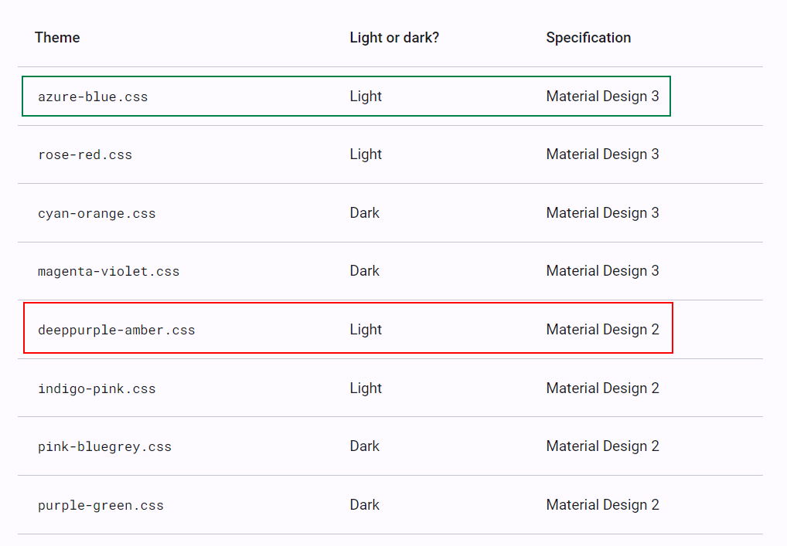
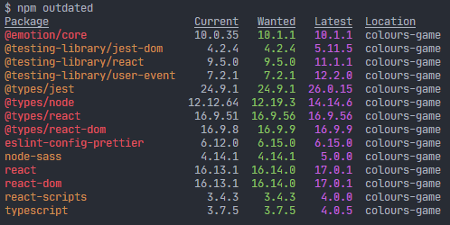
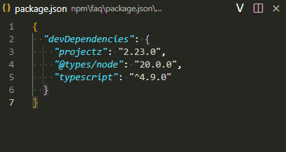
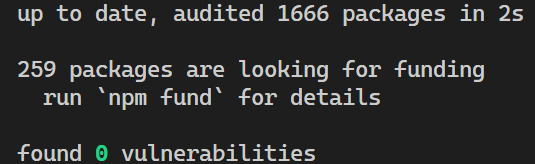

Photo by <a href="https://unsplash.com/@baciutudor?utm_content=creditCopyText&utm_medium=referral&utm_source=unsplash">Tudor Baciu</a> on <a href="https://unsplash.com/photos/flat-screen-monitor-and-black-ceramic-mug-vc3iVL_znJ8?utm_content=creditCopyText&utm_medium=referral&utm_source=unsplash">Unsplash</a>

# Upgrading Angular - Lessons from a 13 to 18 move

This guide highlights some steps for consideration when upgrading the version of Angular you are using. This is based mainly on my experience of upgrading a project from Angular 13 to Angular 18. All the steps and options listed below have been applied for that upgrade. However, proceed with caution, all those changes required extensive research to understand the implications of the change fully and this was backed by cumbersome developer testing and a plan for a full test regression cycle before a production release.

The time will come to upgrade your Angular version. It is best to not lag too far behind as it becomes a bigger chore to eventually catch up, especially if you are now forced to do it due to the need for new features or packages that are only available for a later version of Angular.

> ⚠️ There are multiple steps to go through for these upgrades. Make sure to do a step at a time, build and test, and address any issues, before moving on to the next step. Doing a big bang is a shortcut way to failing the whole upgrade and eventually ditching it.

Do not do the upgrades by hand, but instead make use of the official update tools, using the tool available [here](https://angular.dev/update-guide). The tool allows you to choose the from and to version and provides a guide. If you are upgrading across multiple versions, I would recommend doing it one version at a time fully testing things and addressing any issues before progressing to the next version. Make sure to go through and tick other dependencies like Angular Material and whether or not you are on Windows.

> It is best to select the Advanced application complexity in the tool so it gives you detailed guides on what to look out for and you can just ignore what is not relevant in your case. If not sure, do a code search for the mentioned components or APIs that should be updated.

The process boils down to running the command `ng update @angular/core@xx @angular/cli@xx` for the target version and going through the rest of the guide for any manual changes that are required. If you are working with material you will also be asked to run the command `ng update @angular/material@xx`. The tool will make any required changes to your `package.json` file and install the packages. This includes core angular dependencies, angular tooling and dependencies like TypeScript.

> Make sure you have no pending changes in GIT before running the commands and commit after each step.

> Check the node compatibility for the version of Angular you are targeting as you may also need to upgrade that. I highly recommend you make use of [nvm](https://github.com/nvm-sh/nvm), so you can work with multiple versions of node on your machine, especially if you work across multiple projects.

## Breaking changes

You may encounter breaking changes, depending on your project. Here are some examples of things I ran into while upgrading from Angular 13 to 18.
- Angular 15 requires form models to now have a generic type parameter. You can still opt out by using the untyped version of the form modal classes.
- Some dependencies, `rxjs` being one you will likely run into and particularly component libraries, will have versions that support specific Angular versions so as you update Angular you will have to bump some of these up too.
- The `package-lock.json` file can get corrupted and track incorrect information. If your `npm install` starts to fail oddly or complain about packages missing that are in the `package.json` file, it may be best to manually delete the `package-lock.json` file and run `npm install` again. If this does not work, delete the `node_modules` folder, run `npm cache clean --force` then `npm install`.
- Angular 16 drops the `entryComponents` option in modules.
- Angular 18 does not accept certain special characters in string literals in HTML templates, like the `@` character which I had to replace with `&#64;`. The failing build was very clear about this issue and made a change recommendation.
- When updating material there is a chance that some of the look and feel in your application may change and some weird UI bugs may also pop up, for example, controls no longer being positioned properly. Make sure to fully test things.

These are just examples of some breaking changes you can encounter. The good news is that any Angular-related changes I ran into were already mentioned in the upgrade tool with recommendations.

I am quite pleasantly surprised at how useful the Angular upgrade tool is and how much it automates, combined with how well the build gives detailed errors for anything that needs attention. While these upgrades remain quite tedious and very demanding in terms of testing, the tooling did make this significantly better.

# New Angular, now what?

Now you have the new Angular and all the new features at your fingertips and any of the benefits like improved build and run times etc. One beast you may want to confront already is that over time you may start to have inconsistencies in your project. For instance if you now suddenly have access to the new standalone components, do you now only use them going forward and retain the modules you already have?

That is a tough question and the answer may largely depend on how complex your project is and how bold you are feeling. I would however recommend migrating as much as you can to use new features if you are already going to invest in tons of regression testing.

### Migrate to use standalone components

You can migrate to use the standalone components using the official tooling `ng generate @angular/core:standalone`, see more documentation [here](https://angular.dev/reference/migrations/standalone). This will migrate in 3 steps
- Convert all components, directives and pipes to standalone
- Remove redundant NgModule classes
- Bootstrap the application using standalone APIs

> I highly recommend biting the bullet and doing this one as this highly reduces boilerplate code.

> When I did this I had to address a few things manually. Suddenly some components that were using `app-sidebar` that does not exist with Angular 18 only started to fail the build after this move. A manual step we have to pull app configuration was also not migrated well and only done for the app root, but not for child components that required it.


## Migrate the material theme

If you are working with material and have updated across Angular material versions that also have an update to the material specification, for example from the material specification 2 to 3, you may need to update your base theme if you are using any as those these target a specific specification, documentation [here](https://material.angular.io/guide/theming). In our scenario we had the deeppurple-amber.css as the base and we chose to move over to azure-blue.css.



### Migrate control flow syntax

You can migrate to the new and shiny [control flow syntax](https://angular.dev/guide/templates/control-flow) available since Angular 17 that simplifies the use of directives like `*ngFor`, `*ngIf` and `*ngSwitch`. This can be run using the official tooling `ng generate @angular/core:control-flow`

### Other migrations

There are other migrations that you may be interested in that have tooling support or are fully documented. See the available migrations [here](https://angular.dev/reference/migrations).

### angular.json

Depending on the version update you may also want to make changes to your `angular.json` config file.
- `browserTarget` is dropped for `buildTarget`
- `defaultProject` is now obsolete
- `defaultCollection` is now obsolete

> You can find out what needs to be changed by opening the file in your IDE to see any warnings. Comparing what you have with the default that is generated for a new project on the same Angular version is also a good idea.

### tsconfig.json

Given that the version of TypeScript would have been updated, you should also look to see what configuration can be updated in the `tsconfig.json` file
- Consider newer settings like
	- [noPropertyAccessFromIndexSignature](https://www.typescriptlang.org/tsconfig/#noPropertyAccessFromIndexSignature)
	- [noImplicitOverride](https://www.typescriptlang.org/tsconfig/#noImplicitOverride)
	- [esModuleInterop](https://www.typescriptlang.org/tsconfig/#esModuleInterop)
	- [skipLibCheck](https://www.typescriptlang.org/tsconfig/#skipLibCheck)
	- [moduleResolution](https://www.typescriptlang.org/tsconfig/#moduleResolution) move from `node` to `bundler`
	- bumping up the ECMAScript version under `target`, `module` and `lib`

# Other dependencies

This is a good time to look into upgrading all other dependencies, and in particular, some dependencies will be tied to a particular version of Angular, Node or TypeScript, which would also likely have changed.

Make sure to read the official documentation of each package to see what has changed and check the compatibility information. If you are far behind you are very likely to meet many packages with API changes.

> ⚠️ Update packages one at a time making sure to build and test your project afterwards. A big bang update and then having issues is a nice way to get bogged fail here.

Consider making use of the command `npm outdated` to track packages that need updates through a convenient report.



Also, consider making use of the VS Code extension, [Version Lens](https://marketplace.visualstudio.com/items?itemName=pflannery.vscode-versionlens) for convenient information directly in your `package.json` file with upgrade actions directly from there.



Specific dependencies you may want to immediately update if you depend on are
- rxjs
- component libraries, i.e. ngx-bootstrap
- eslint

Hopefully you can update all packages and get to see this nice report on `npm install`.



## Cleanup

We took the Angular upgrade as an opportunity to identify and clean up any unused packages. That is a little less to worry about upgrading and this can also help keep bundle sizes reasonable.

Unused packages are not as simple as checking the `package.json` and finding something that is not used at all. Some may be used in modules/components that are not used in your project which would mean also deleting those artefacts.

# Package.json

Make sure the common CLI tasks that developers run are available as scripts in the `package.json` file. Examples are serving, building, testing and linting.

Add an engines section so that the team knows and has a reference point for the supported runtimes like node. Example

```json
 "engines": {
    "node": "20.15.1",
    "npm": "10.7.0"
  }
```

> ⚠️ Make sure no dependencies that should be for development only are in the main dependencies list.

## Package-lock.json

When making multiple changes and in particular when the version of node has been updated, the `package-lock.json` can at times get corrupted and have incorrect information. It is a good idea to delete the file once done with the upgrade and run `npm install` again to have the file re-populated.

> If you manage to update all dependencies, great. If not, it is still worth running an audit fix with `npm run audit --fix` to attempt to address packages with known vulnerabilities.
# Testing

I would not recommend investing time in component testing with Angular. Writing unit tests for algorithm type code for example if you have a function that applies some formatting on numbers, that is something you may want to write unit tests for. For this, I recommend bootstrapping [Jest](https://jestjs.io/) onto your project.

> When using jest for tests, keep in mind that jest runs on node and not in a browser, so any code that makes use of browser APIs that you would like to test would require mocks. Local storage is an example of an API that is implemented by browsers and not by node.

If you are not going to be writing component tests, it is best to remove all the dependencies for that (one less thing to worry about and keep up to date). Some dependencies to drop are jasmine, and karma including configuration files (`karma.conf.js`, `tsconfig.spec.json` etc) and any specs you may have already generated (`*.spec.ts`). Make sure to also remove the test configuration in your `angular.json` file.

> If you are making use of the ng generate command make sure to use the `--skip-tests` flag if you are not making use of component tests.
# Node version

As part of the upgrade do not forget to update your version of node. Make sure that you are working with a supported version of Node both locally and for your deployments. Check [the official compatibility matrix](https://angular.dev/reference/versions).

> ⚠️ Do not run on an unsupported version of node. It may work now until you run into very weird bugs in the future. In those situations, you may not figure out that it is due to the node version and even if you do, now what? Bump down and regression test everything? Best to just avoid this. Also, make sure that the version of node used in production is the same one used by developers on their machines.

> A good reason to upgrade Angular regularly is to keep up with an LTS version of Node. Node does however have very long maintenance windows. Check the official documentation [here](https://nodejs.org/en/about/previous-releases).

# Scenic route

If you are making such a big change, this will no doubt be backed up by a regression test cycle. This is an opportunity to address any other low hanging-fruit.

## Imports

Does your project have a lot of imports that walk up and down the folder tree like `../../../..`. These paths are not great as they tend to be long and do not do very well with moving files around, although most IDEs can handle this.

This is a nice time to address this by identifying the most commonly imported items in your project and creating aliases for those in your `tsconfig.json` allowing us to simply something like `../../../components/..` to `@components/..`

Here is a sample configuration, this will differ depending on your folder structure.

```json
{
  "compilerOptions": {
    "paths": {
      "@services/*": [
        "src/services/*"
      ],
      "@models/*": [
        "src/models/*"
      ],
      "@environments/*": [
        "src/environments/*"
      ],
      "@store/*": [
        "src/app/store/*"
      ],
      "@modules/*": [
        "src/app/modules/*"
      ],
      "@shared/*": [
        "src/app/modules/shared/*"
      ]
    }
}
```

> IDEs like VS Code will be aware of this configuration and will take this into account for auto imports.

Jest does not pull this information, so if you using Jest you will need to create module name mappings in the `jest.config.js`, example

```json
module.exports = {
  preset: 'ts-jest',
  testEnvironment: 'node',
  moduleNameMapper: {
    '^@services/(.*)$': '<rootDir>/src/services/$1',
    '^@models/(.*)$': '<rootDir>/src/models/$1',
    '^@environments/(.*)$': '<rootDir>/src/environments/$1',
    '^@store/(.*)$': '<rootDir>/src/app/store/$1',
    '^@modules/(.*)$': '<rootDir>/src/app/modules/$1',
    '^@shared/(.*)$': '<rootDir>/src/app/modules/shared/$1',
  },
};
```
## Warnings

Look out for warnings that would be easy to address
- Build warnings
- Lint warnings
- `npm install` warnings

Some examples of things that may be shown as warnings after an upgrade
- Ambiguous CSS when working with flex layouts, for example, `start` and `end` as opposed to `flex-start` and `flex-end`
- Unsupported engines on doing `npm install` will warn you about the version of node being a mismatch to some packages
- While not specific to the upgrade, it could be good to also address any vulnerabilities flagged by `npm install`. Consider updating all your packages and where that is not possible consider running `npm audit --fix` to patch what would likely not result in breaking changes.
- Angular will warn of the use of any CommonJS or AMD dependencies that can cause optimization bailouts and larger than necessary bundles. Angular can better do optimization during builds when working with ECMAScript modules. This warning will likely be due to dependencies and one common library that causes this is Lodash. In this case, it comes with `lodas-es`, that you can replace with to address this.
- Due to updating TypeScript, you may start to see new warnings depending on what you have in your project.

In the example above of `lodash` warnings, make sure to update the core and types packages to use `lodash-es` and update all imports for example, `import { isEmpty } from 'lodash';` becomes `import { isEmpty } from 'lodash-es';`. If you are making use of jest, you will need to provide a module name mapper in your `jest.config.js`

```json
/** @type {import('tsjest').JestConfigWithTsJest} */
module.exports = {
  preset: 'ts-jest',
  testEnvironment: 'node',
  moduleNameMapper: {
    '^lodash-es$': 'lodash'
  },
};
```

## Linting

If you are modernizing your Angular SPA project, if you are not already working with eslint, I would highly recommend it and if you already are, this is also a good time to review your linting rules. If you are able to, upgrade to the highest eslint version that is supported for the version of Angular you have targeted.

Here is a simple configuration as an example for the latest eslint that now makes use of eslint.config.js.

```javascript
import path from "node:path";
import { fileURLToPath } from "node:url";
import eslint from "@eslint/js";
import { FlatCompat } from "@eslint/eslintrc";

const __filename = fileURLToPath(import.meta.url);
const __dirname = path.dirname(__filename);
const compat = new FlatCompat({
    baseDirectory: __dirname,
    recommendedConfig: eslint.configs.recommended,
    allConfig: eslint.configs.all
});

export default [{
    ignores: ["projects/**/*", "coverage/**/*", "**/generated.ts"],
}, ...compat.extends(
    "plugin:@angular-eslint/recommended",
    "plugin:@angular-eslint/template/process-inline-templates",
).map(config => ({
    ...config,
    files: ["**/*.ts"],
})), {
    files: ["**/*.ts"],
    linterOptions: {
        reportUnusedDisableDirectives: "off"
    },

    languageOptions: {
        ecmaVersion: 5,
        sourceType: "script",

        parserOptions: {
            project: ["tsconfig.json"],
            createDefaultProgram: true,
        },
    },

    rules: {
        "@angular-eslint/use-lifecycle-interface": ["error"],
        "@angular-eslint/no-empty-lifecycle-method": "off",
        "@angular-eslint/directive-selector": "off",
        "@angular-eslint/component-selector": "off",
        "@angular-eslint/no-output-on-prefix": "off",

        "no-unused-vars": ["error", {
            vars: "all",
            args: "none",
            ignoreRestSiblings: true,
        }],

        "no-console": "error",
        "no-alert": "error",
        "no-debugger": "error",
    },
}, ...compat.extends("plugin:@angular-eslint/template/recommended").map(config => ({
    ...config,
    files: ["**/*.html"],
})), {
    files: ["**/*.html"],
    rules: {},
}];
```

> If you have a linting setup, make sure that your commands (ideally scripts in the `package.json` file pass the `--cache` flag for faster runs). This will ensure that the linter only runs on files that have changed since the last run. Make sure to ignore the caching file from GIT.

> If you have a linting setup, I highly recommend making use of [lint-staged](https://github.com/lint-staged/lint-staged), to allow developers to run linting only for files that they have changed and are staged in GIT.

> Keep your linting clean. Having tons of warnings that no one ever looks into is a nice way to slowly get the team to not care about linting. Either address all warnings, ignore existing warnings that are too difficult/risky to address or a combination of both.

## Other cleanups

Also, consider other cleanups
- Remove any unused static assets to keep your bundles small.
- Consider your `node_modules` as well as your npm cache a mess right now and delete the folder, run `npm cache clean --force` and then `npm install`
