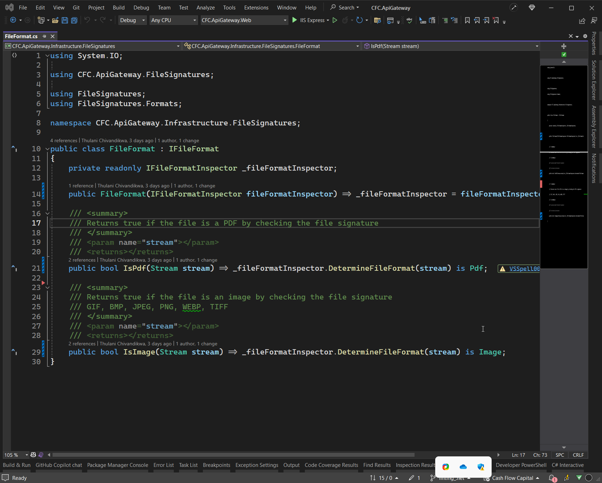

Photo by <a href="https://unsplash.com/@riku?utm_content=creditCopyText&utm_medium=referral&utm_source=unsplash">Riku Lu</a> on <a href="https://unsplash.com/photos/black-flat-screen-computer-monitor-wvJuYrM5iuw?utm_content=creditCopyText&utm_medium=referral&utm_source=unsplash">Unsplash</a>

If you cannot escape the reality of having to dance between using Visual Studio and Visual Studio Code, but really appreciate consistency you may  find [Theme Converter for Visual Studio ](https://github.com/microsoft/theme-converter-for-vs))interesting.

This extension allows you to identify a theme you like in Visual Studio Code ([great options available](https://vscodethemes.com/) and export it for usage in Visual Studio.

>  There are other investments that can be made to make them more consistent. Small things go a long way like having the editor bar on the same side in both, having the font style, sizing and spacing be the same, choice of mini map etc.
